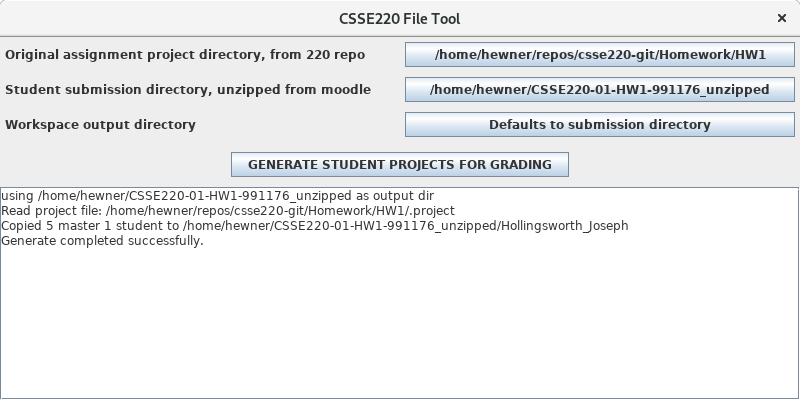

A guide for CSSE220 graders and professors.

# Getting the Stuff You Need

There's a few things you need on your local system

1. Clone the public csse220 repo from github ([here](https://github.com/hewner/csse220)).  This will get two useful
   things:
   - The Csse220FileTool.jar -- in Administration
   - The original source code for the Assignment -- in Homework/WhateverTheAssignmentIsCalled
   
   If you already cloned the repo before, be sure to pull to get the
   latest version of everything
2. A unzipped version of the moodle homework submissions.  To get this:
   - Go to the Moodle for the course and click the assignment on the main page
   - Look for the Assignment Administration menu and click "Download all submissions"
   - Download the zip file someplace handy
   - Use your regular unzip tool to unzip the file someplace (just be
     sure you know where the directory you unzipped it to is)
      
3.  An running eclipse with the workspace you'd like to import into (probably a new clean workspace with no projects)

# Running the File Tool

1. In windows, you should be able to just double-click on the
   Csse220FileTool.jar to run it.  Or can run it from the command
   line:
   
       java -jar Csse220FileTool.jar
2. A GUI should appear.  Click the buttons to configure the project
   assignment directory and student submission directory.  Then click
   the generate button.
   
   You can see a successful test run in the image below.  Your
   version should have a lot more directories copied (1 for each
   student):
   
   
    
# Importing the Projects into Eclipse
    
1. In your eclipse with the clean workspace, go to File > Import
2. On the Import wizard window "General > Existing Projects Into
   Workspace" and click Next
3. Set the root directory to the workspace output directory from the
   previous step (should be the same place you unzipped the original
   moodle zipfile to unless you changed the default)
4. You should see a bunch of projects named after students appear in
   the Projects pane.  Make sure they are checked and click "Finish"
5. The projects should appear in your project explorer and you're
   ready to grade!
