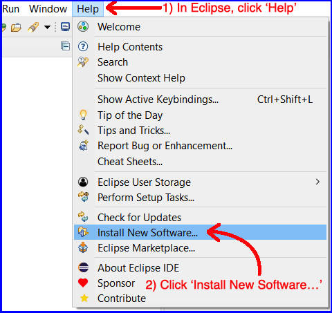
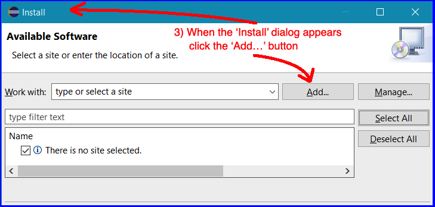
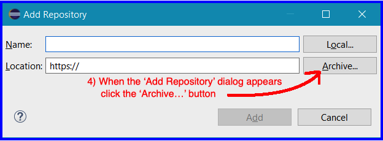
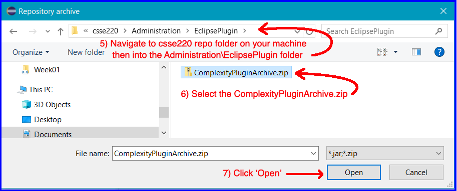
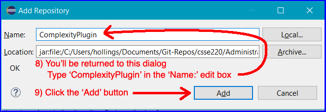
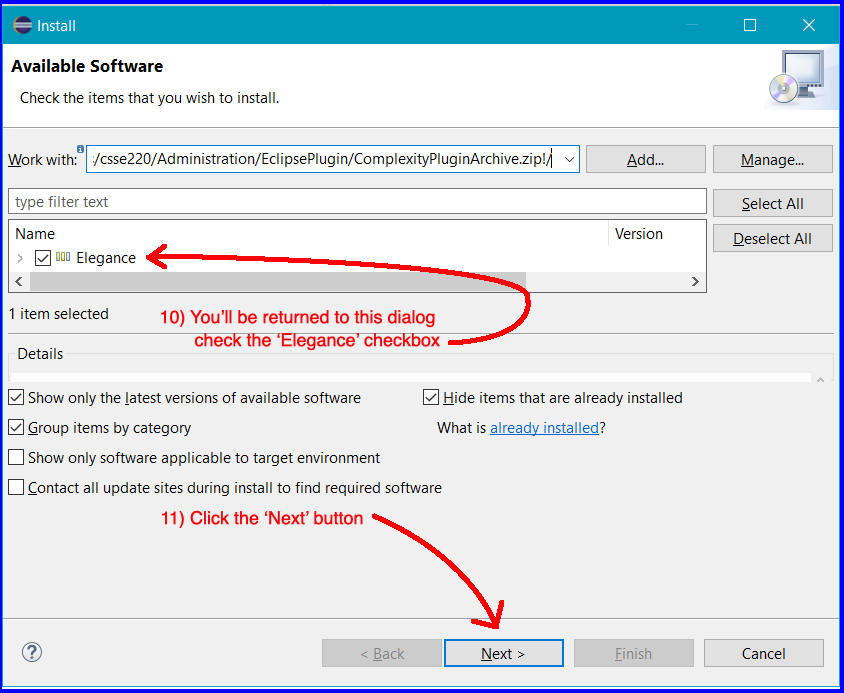
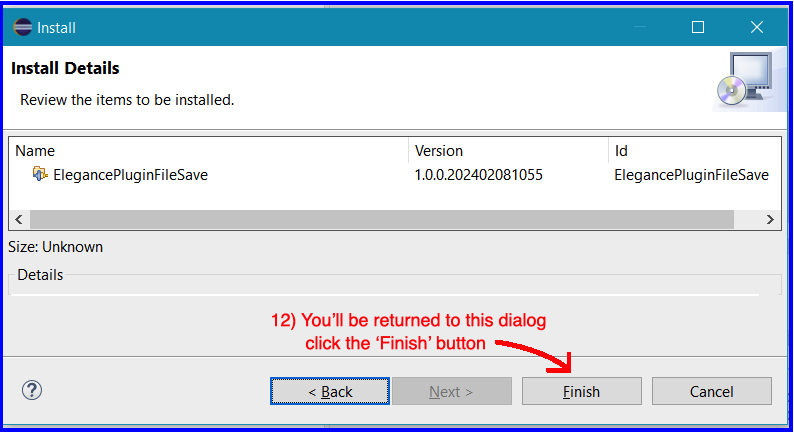
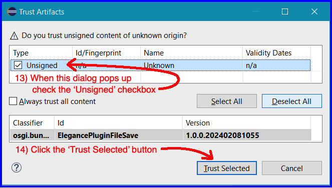
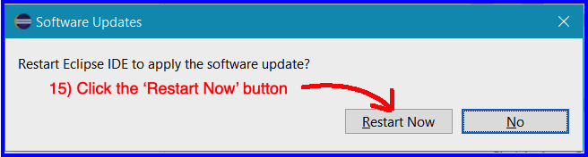

# Install the Complexity Plug

## Follow closely the instructions in the screenshots (below)

## Step 4.5 
For the next step, finding the folder can be hard. Eclipse defaults to this location, but please fill in "YOUR RHIT USERNAME" with your username: "C:\Users\YOUR RHIT USERNAME\git\csse220\Administration\EclipsePlugin". Try there first. If that doesn't work, you can cancel to go back to the Package Explorer > Find HW1 and Right Click it > Show in > System Explorer > click in the address bar > copy the file path > repeat the steps above > paste in on step 5 > go up one level from the Homework folder to the Administration folder (up arrow in windows) > EclipsePlugin folder. 

## This "Trust Artifacts" window may take some time pop up, please be patient:

## That's it! You've installed the Complexity Plugin
