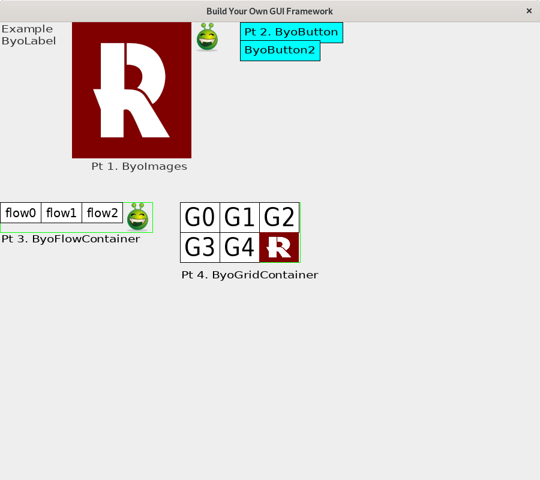

(8) Inbox – ACNW 2019 Slot 4: Under Her Heel | Fastmail# Build Your Own GUI

So in this lab you will build you own rudimentary GUI system similar
to Java Swing.  Our GUI system will be able to draw itself on the
screen, arrange elements, and respond to mouse click events.  Similar
to Java Swing, we will use inheritance a lot to reduce duplication.

Here's the where we'll get over the course of the lab:

You'll want to refer to this image several times as we proceed.
# Starting point

The above diagram shows the system you are given.  Here's a breakdown of the parts:

* ByoGuiViewer - the class with main which also contains all our testing code
* ByoMasterComponent - this is the only JComponent in the system.  It
  draws the entire Byo GUI in its paintComponent, calling the drawOn
  methods of its child ByoComponents.  Though this is an important
  class, you won't have to modify it.
* ByoComponent - the Byo equivalent of JComponent...the superclass of
  all objects in the system.  Its abstract methods are the ones you'll
  have to create when you make a new ByoComponent, so it's good to try
  and understand them.  Note also it stores position data: subclasses
  can read this data using the getters, but it can only be set by the
  method setPosition - this will turn out to be important later.
* ByoLabel - this is the Byo equivalent of JLabel, and it is
  implemented for you. Feel free to take a look at its code to get a
  feel for how ByoComponent subclasses should look.
* ByoImage - the first class you will implement yourself

Run the code and ensure you see a picture and then go ahead and get started.

# Part 1: Implement ByoImage

Remove the first set of comments in ByoGuiViewer.  You'll have to
create a ByoImage class, make it a subclass of ByoComponent, and give
it an appropriate constructor.

To actually do the drawing, you'll need to use ImageIO to load a
BufferedImage.  Here's how you should load the image (do this in your
constructor):

    try {
	    this.image = ImageIO.read(new File(filename));
	} catch (IOException e) {
		throw new RuntimeException("Could not load image file " + filename);
	}

To draw with the loaded image object in drawOn, do this:

    g2.drawImage(this.image, getX(), getY(), getWidth(), getHeight(), null);
    
## What is preferred width/height?

So from Java Swing, you're probably familiar with the idea that GUI
elements sometimes are drawn larger on smaller than normal.  If we add
a JButton to the center of a JFrame, for example, it will be drawn to
fill the entire window even if that window is very large.  But
JButtons do have a "preferred size" exactly big enough to fit the text
with a little border.  If you put a JButton in standard JPanel, for
example, they will always draw at that preferred size (or maybe not
draw at all if the window is too small).  The preferred width/height
is how big our item wants to be and depends on its contents.  The
actual width/height can vary, but some layout schemes try to
accommodate the preferred sizes when possible.

ByoComponents will use this same idea, so our components will have to
calculate their preferred sizes.  Just remember:

* When asked for preferred size, you should calculate based on your
  contents (i.e. you should not use ByoComponent's getWidth() or
  getHeight())
* When its time to actually draw, you need to use ByoComponent's
  getWidth() and ByoComponent's getHeight() NOT preferred size.
* Some layouts (in particular ByoMasterComponent) will use your
  preferred size.  BUT they will always get your preferred size with
  the getters and then explicitly call setPosition to make your
  preferred size your true width and height.
  
For ByoImage, the preferred size should be the width and height of the
BufferedImage you loaded in the constructor.

BTW, if you make getPreferredWidth and getPreferredHeight functions
return 0, no image will be displayed.  So if you're building things
one function at time, hardcode them to some non-zero value.

Make sure your images match the picture before you go on to the next
step.

# Part 2: Implement ByoButton

Uncomment the relevant sections of ByoGuiViewer as you do this part.
The given code should make clear how the ByoButton constructor should
work.

## Sizing & Drawing

So a button in the byo system will be basically rectangle of a
specific background color, a 5 pixel border, and then within that a
ByoLabel with the given text.  So ByoLabel will actually do most of
the work of drawing.

The design question for you - should ByoButton *be* a ByoLabel
(i.e. should it be a subclass of ByoLabel) or should it *have* a
ByoLabel (and be a subclass of ByoComponent).  Both solutions can work
BUT be sure you do not duplicate the code of ByoLabel into ByoButton -
that is wrong and you'll lose points.  You can edit ByoLabel if you
need to but it shouldn't be necessary.

If you do go the subclass route, remember that you can call methods in
your superclass that you've overwritten by saying super.someMethod().

If you go the non-subclass route, your drawOn will call the label's
drawOn as part of its drawing process.

The preferred size of the button should be the size of the underlying
label, plus 10 pixels in each dimension to ensure a 5 pixel border
surrounding.

## Button Clicks

To be buttons, we have to respond to clicks.  To that end, Byo has an
interface called ByoClickListener that is the Byo equivalent of
ActionListener.  ByoButtons should be able to have listeners added to
them and then when a click occurs they should invoke the listener's
clickPerformed method.  Hint: save the listeners in an arraylist or
similar structure so you can invoke clickPerfomed at a future time.

To make the ByoButton aware of clicks itself, simply override the
acceptClick method in ByoComponent.

Calling addClickListener and passing a ByoClickListener should just
store the listener in the button.  Then, when a click happens, the
button should call the clickPerformed on the stored listener.

The ButtonChangeClickListener used in ByoGUIViewer should make the
buttons change color when you click them, so when you uncomment that
code you should see your buttons respond to clicks.

# Part 3: Implement ByoFlowContainer

So now we're going to implement a new kind of component - the
ByoFlowContainer which contains other ByoComponents.  This is a Byo
equivalent of JPanel.  Uncomment the test code in ByoGUIViewer and
take a look at to get a feel for how it should work.

ByoFlowContainers should arrange their subcomponents from left to
right, keeping each of them their preferred size.  So the preferred
width of a ByoFlowComponent should be the sum of the preferred widths
of its subcomponents.  The preferred height should be the height of
the tallest subcomponent.

The way ByoFlowContainer should do its arranging is to walk through
the list of subcomponents, setting the x y width and height of each
subcomponent to the right position based on the containers x and y and
the components order in the list.  Don't worry about the
ByoFlowContainer's width and height - we're going to assume that it's
always set to its preferred size.  You should extract this positioning
into a single method - I called mine computeChildPositions.

Here's an example.  Say you have a ByoFlowContainer at 1000 1000,
which has 3 subcomponents each with a preferred width of 100 and
preferred height of 100 200 and 350 respectively.

First off, the containers preferred width is 300.  And it's preferred
height is 350 (max of children).

Then, the first child should be positioned at 1000 1000 (right at the
start of the container).  The second child is positioned at 1100
1000 - directly to the right of the first child.  The third child is
positioned at 1200 1000, again to the right.

computeChildPositions should be called each time something changes -
either when a new child is added with the addChild method or when
setPosition is called on the ByoFlowContainer object (hint: when you
override this, be sure you also call the ByoComponent's version of the
method with super).

If you get computeChildPositions implemented correctly, the other
methods should be pretty easy.  DrawOn should just simply draw a green
rectangle around the whole area and then have the subcomponents draw.
Again, don't worry about the overall width of the container when you
do drawOn, we're going to assume its big enough.

acceptClick should use the ByoComponent method containsPoint to figure
out which of the children has been clicked on, and then call
acceptClick on that one.  Make sure your flow subcomponents draw as in
the picture and the buttons change color when you click them.

# Part 4: Implement ByoGridContainer

ByoGridContainer is going to be another container that lays out its
elements differently.  In this case, it's going to take a preferred
width, height, and number of rows and columns.  Its children will be
scaled to fit within exactly one cell of its grid of rows and columns.
Uncomment the example code and look at the picture to get the idea.

The ByoGridContainer preferred width and height should be as set in
the constructor.  As before, when we draw we not be concerned about
what happens if ByoGridContainer is not given its preferred size.
However, ByoGridContainer should force its children to be the size of
its grid cell - it should not respect the children's preferred size.

Here's an example.  Say you have a 2x2 ByoGridContainer at 1000 1000,
which has 3 subcomponents.  The preferred with and height of the
container is 300 by 150 pixels.  It has 3 children - it doesn't matter
what their preferred height and width are.  All children will have
their height and width set to 150 by 75.

- The first child's position is 1000 1000.
- The 2nd child's position is 1150 1000
- The 3rd child's position is 1000 1075
- There's no forth child, but if there was it would draw at 1150 1075

The challenge here is that we don't want to duplicate code between
ByoFlowContainer and ByoGridContainer.  So we're going to create a
common superclass, ByoContainer that will contain the common parts of
the code.  Here's how my system worked out:

The key thing to note is the abstract computeChildPostions method in
the ByoContainer (indicated by italics).  By implementing that method
in the subclasses, each one can have a different layout.

You don't have to implement exactly my solution, but you do have to
minimize duplication between ByoFlowContainer and ByoGridContainer.

# The End

That's it!  Make sure you picture matches and submit all edited files
via Moodle!
