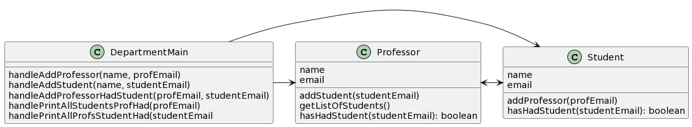
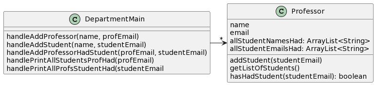

# CSSE 220: Design Problem 1 Makeup - Students X Professors
Create an app that tracks all the students that a particular professor has had in a class.  A professor has had a student in his/her class if the student has signed up for any one of his/her classes, even if the student later dropped the class.  In this app, we only need to track the names and email addresses of both the professors and the students (assume that email addresses are unique), no other information is required for this application.  The app must be able to do the following items:

- Add a professor's name and email
- Add a student's name and email
- Add the case when a professor has had a student in a class
- Given a professor's email address, print all student names and email addresses who that professor has had in all classes taught by that professor
- Given a student's email address, print all names and email addresses of the professors who have had this student in a class

## Bad Design A

[Source PlantUML](http://www.plantuml.com/plantuml/png/bP7HIiOm38Nl-nIv_0Lz0H7vVr3OXUB09uWsqqBQZgQx4j_TreLkQXMyMiA-St8EFKh6b1VFvfbH16veBhkdaE_H1NWp0F2AmJATh1rJd4WafaD0J-Smb_tMe-EpBzXZNcmnK4ZMJRcktO1Dqon_5Ox9XNnYLeLKbsAWoZvR6L51PVVMvjrezvPdhLtZrozzKdN2hTkFS2-KxvpaXqa9EMWE6R2lkeId69amR0cK--D-oxZr_TUTR-zxSGsgwVnfjqoRu6gdC4SATl7y0G00) 

## Bad Design B

[Source PlantUML](http://www.plantuml.com/plantuml/png/TP7BIaD138RtynIXgohw0aLA3oYuy5Be4qGdhGVcKYRfGiHtDw53glPqTKwOx_yoFxDYmIQ7dC9xGcQufxtEcOeyurZWAm301vQOQ8XntUgMc6kR5ynq0tkT7pAEwUeFjf53L467-3XDSAvxHC-uyc9mtSOYGqezmMPHWIUdM6Eu1upzhGxVeNVt-nnhs_NjIqRP3_hI5prY5IrWQ0q_dqQMkuteijto1Fg6IwIX6BtwMTyTYV6lsqxml5SpuMHg0M-r9i9YfVuzvUroTZqxTGnXHINgm_y0) 

### Hint
Both designs have the worst kind of problem: *they don’t function*.