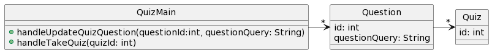
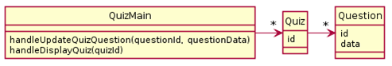

# CSSE 220: Design Problem 1 - Online Quizzes
In an online quiz application, teachers update quizzes and students take them.  Quizzes and questions have their own unique id number. The same quiz question can appear in multiple different quizzes.  If a teacher updates the actual query made by a quiz's question, it's important that this update to the query is reflected in all quizzes that utilize that question. A student takes a quiz by providing a quizId to the app at the time of taking the quiz.

## Bad Design A

[Source PlantUML](http://www.plantuml.com/plantuml/uml/RP11JiCm44NtFiLNDr2W5-W2bIKI5LIb1nZL9Xd5cGHxl4WGTyT984ealB1iF__tPH-YKj1KUnChbfO2rOZQUPVdmDUHv763Dq-Yb-CBFfg0L_4i3gV4FSwDJygDuCcOgwSOn-CZiU3B0BWlIQntbzQIkW6Taej3uFRpT_5izopwWBzzlX2wFSuQM8hjml5ErMZ8IUvp2ZcsDT_BtgcJ9xP4atgDWVyxXzpyY5tWejJTu-PkCslCx5jJxit1YSsVzWC0) 

## Bad Design B

[Source PlantUML](http://www.plantuml.com/plantuml/uml/RO_1Je8n48JlVOe95q7b1JWOF9f8b20FiA4LDko_FxJR0nhVtVwjcbzZ3vjslivCTfcCekLEN3godYXIXsGN2ML6tbLIpXMUXTIsgqUyzX5FAgm1wynlsFIIZNl5lNCxePIgl29Ml3i0DmTIBs5xycHXGEiSqc2Odhyk3tx1QhVuVfSFyRB0nYBhVZRAUA5ZJPYUooWk5DlCVOnxMoStDaOj-ZS6_kySV3zBp2Fl3pQ_crnFQaCbVzIMuPP1VUxa4m00) 

### Hint
Both designs have the worst kind of problem: *they don’t function*.