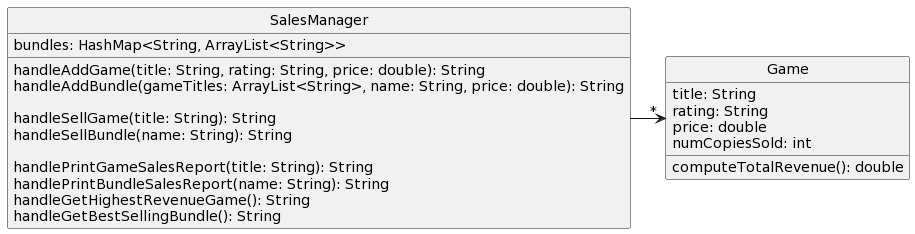
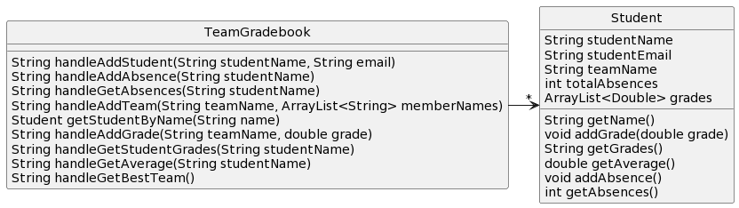

# CSSE 220: Design Problem 2 - Vapor Video Game Sales
Vapor, the popular video game digital store, has hired you as a consultant to design a sales management application. Each game available to purchase through Vapor has a title, ESRB rating (e.g., "T" for "Teen"), and price, all of which are fixed. You may assume game titles are unique. 

Vapor also sells game _bundles_, which complicates their sales records (hence why they hired you instead of designing the application themselves). Each bundle is a set of games with a clever name (e.g., "Boom Bundle 2") and price (less than the sum of the individual game prices) determined in advance by the marketing team. Every bundle contains at least two games, and a game may appear in more than one bundle. You may assume bundle names are unique. 

For any given bundle, Vapor wants to be able to generate a report including the bundle's name, price, included game titles, how many times the bundle was purchased, and the total revenue from that bundle. 

Also, Vapor wants to be able to produce a sales report for each game, including how many times the game has been sold individually or as a bundle, as well as the total revenue from that game. For calculating total revenue, Vapor distributes the sales price of each bundle evenly across all games in the bundle. For example, a bundle of four games sold for $60 should count as $15 of revenue for each game. 

Finally, Vapor wants a method to determine the game with the highest total revenue and a method to determine the most popular (i.e., most copies sold) bundle. 

## Bad Design A

[Source PlantUML](http://www.plantuml.com/plantuml/uml/XLBDQiCm3BxhAKnFtUXUe8pITeVsiC9e-W9gBL8pnmwsN2XZxpx5DCGXOxiaMFf-FbbUHyR0gR4GFurhCM2Z8jyjoJUOI-x0nMACga9ByO0EQmhg2yx9QIairHxZzO3jQoK4Lo_K9WIylvl8Zyfg1N353hpHUeSDpTcmfQNg2G5P_iEv5MDfQv_Ebfxw-g2npSxpMgHEeYGPffuBvQJzdsOVh29hfya6s81wU9VY4xKFEN0dbs_iIAqF_BToPcJfaZDrAIWxuhsfhnJvI3ToYNB-Nr1RWNJ9fPWTIX1yGx_TZYvR7SM4yMPWT8dWKlFcMqEnybOlbKm04CL8YlVEu-QDXejlsiHqyeps4LHwlKGnVJdt453oZPxToshsFCjPOKrEfyR-0000)

## Bad Design B

[Source PlantUML](http://www.plantuml.com/plantuml/uml/jPFDQW8n483lynJ1IssnBo15r1xieItY-WAf6TRGRB8a4q6Axzw96zaiIaiFlHWpFr--JDXv8EafDWR2fxQjzB8HWOu6-TVhtJa3EoD349Kq6DwabJLwyGMmbrOPN2YraWsEIPF1gQYuozOJuINnskzRXd5QkVXXyFuIxndBcFwCQqPj4obCnS9xUNpLWPwwujb4M4x_oipG2esvDklB-gfyTWc_egrvGmbtdi86M-Vf9tBkwD1bpyrJSiiAwKNNUmoqmGFQY6V_6rLBBadc7CpoXV09BY-Mslcb1femV1aO315iR9vTgp5KpgYfu1i0t8aQwRrCfDDIAh02HuzfVt1QmSurRIJSEf8cNu5p6LxEfPX8eNwwY7UNOlKqhNzLpPPhz3oilyeEleZ7sUXXbCsXMt8iaM6ELiN6V0C0)
