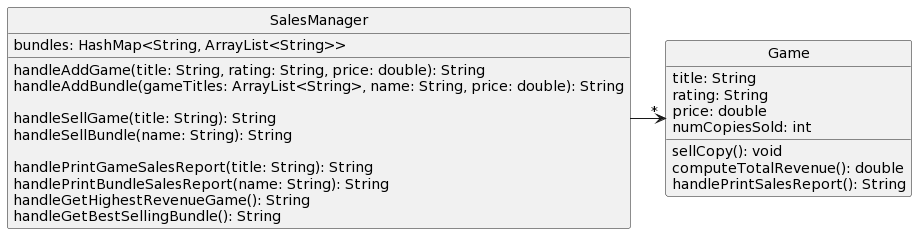

# CSSE 220: Design Problem 2 - Team Gradebook
This is a grading application for a hypothetical school's class. In this class, each student is a member of one or more teams - each team has a unique name.  For students, a name and email should be tracked. The teams are assigned grades for the work they submit.  Students only receive grades by belonging to a team and that team getting a grade. Since students can belong to multiple teams, a student's average is the average of all the grades earned by each of the teams to which that student is a member. The app will also track each student's absences.  There should also be a method to find all the grades a student has received across all the teams to which the student belongs. There should be a method to get a String representation of the best Team. NOTE that "best team" is different from the team with the best students. To find the best team, averages should be calculated using the grades FOR THAT TEAM - not including grades any students might have in a different team.

## Bad Design A

[Source PlantUML](http://www.plantuml.com/plantuml/uml/ZPF1JiCm38RFv2cidJO4F012qpQ1Ta5SnctQmLsi4fQaA7OdJMZlZf8seckBM4-j_SVs_pbTi62Gsbd51-E_CA03bfCbO0bcdp9xYypmJkZM0JKLLNM0xVOJZ_WetU33XMItWszriv5WV0aVwBMbfTORgJLvcRPnRZxVqD4Tj35oQEniU7HPCFazZHpjYzSahPZ_LQVISV2iZ9QQUPOXuEdLi3mrgJauSWM5cELK9TM4agHzNPrYBbVouyqIeM4tNTM59IXZTgQWVNg-SgDKWwz4SQI0vPNSLiIIQCpKkRFul_UTrfodxPdAyGx9v-HotjZaB1YYpcE-nCl0_GObIGBzo-bO6GsOuOwppD6CPEpyfjDsUdaXp-ho5xYVm-Hsal2e1NbTE_i3)

## Bad Design B

[Source PlantUML](http://www.plantuml.com/plantuml/uml/ZPF1JiCm38RFz2cidHW27W2XQPj0ko0kupRju2vM24jI5BkJ9iIxewQ9khLbMavjVljtyltjd0M3rCuMl3V-6mCwO3bQ0fPWTb7PMMI63qAt2gYehAezR3PVUC0dETryF2lPRk6dk5bBC5x39tfbQQ7KMcf5NcxJFhUlx-Ze7j8UEJHsEcnTb4n-HoEj_U8LIIhcozNPkZbuhcokr9vd4G8UtmpBSolDm94hAJGgHvVe2PeaFIwFZPQT_FYmI6WuJLLrQGbqequBIAjthpmeUl2LA0uKK5_9RKaiaSQq-4t1fv7ZaISnXWrf3GVz8xqsIVUqJAJhCLv0Aa6RCytAIK0l4TwifSTzIqqIS-cm7YgZ07CM5z5hohGxAJTak6FMwRH9oHVHtQSP4P__LGypcDnDCl5YJbxLplu1)

