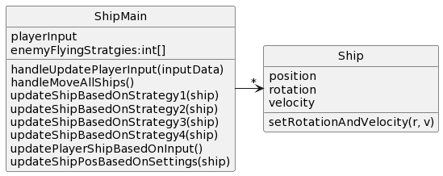
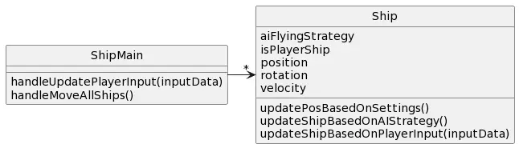

# CSSE 220: Design Problem 3 - Spaceships
In a single player spaceship racing game, the mechanics surrounding ships are particularly important.  Each ship has its own current position, rotation, and velocity.  Rotation and velocity can be increased or decreased by the player’s controller - this is how the ship is steered. When a ship or multiple ships are computer controlled there are 4 different flying strategies that control how the ship moves in the game. When the player controls his/her ship, the ship gets input from the player’s controller which sets rotation and velocity. There are two commands to consider: updatePlayerInput which is called when a player presses a key on the controller and moveAllShips which updates the position of all ships in the game based on their current settings.

## Bad Design A

[Source PlantUML](http://www.plantuml.com/plantuml/uml/XL5DImD13BtFhnXwseeUj3rv42eYU2WMIxs8Xx0Rji7Pp339BWp5_-xiXxLwi9VmalVoXhoH3-804HehcXpc6gdKjd76b0v4x7PFOGt4zc2i3GuInYSEhUOE6Plqw19nlTK8MXFABR6-lMTo3rmvt8KA53S_QmNrzG4KvaVHsdUuSgv_IOf-t0vRVNyFWjKp3_POf-j2yl1VoSrvoUAyPFb7Cbvm8XoF-UsnyV9jWwev5PbSpET9c6EGNaZ9SuRHAqomG-TBqfIXeBvCn8ghruaeugNjvjdE7B_bwixEBcQ3ynS0)

## Bad Design B

[Source PlantUML](http://www.plantuml.com/plantuml/uml/VP1D2y8m38Rl_HLb9nKy-74M52yUH67u0y9Mjs3MbYOJXlZVRVqO7dINaFP9dvINBsWz16WqIqScre25j0qfLH0mwxn6lmUq-gQqhi6MP4w-1357Wiw4dVMjZ33LBGYC-w6zkverKNhEex6wV-cUgZDrQAjSGbHLNRn0VXdJH3nwnoZeR6o34tYtLqEkG4dpxUiNZZV0fZpOt8X4OrhsWKdreUz5is4y7yQBORpyZVya5JDHVRhJbSucsJEU1m00)

