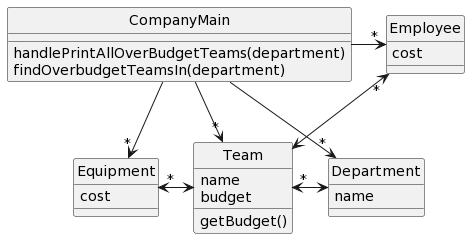
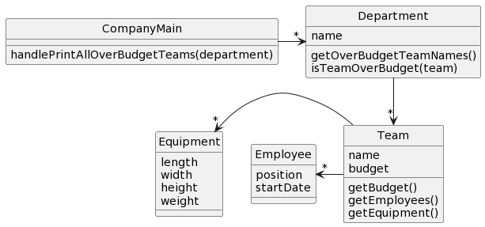

# CSSE 220: Design Problem 4 - Team Budget
At a particular company, departments are composed of named teams and each team has a yearly budget. Teams have both employees and equipment, each of which have a yearly cost. A team is over budget if the total yearly cost of all employees and equipment is greater than the team's budget. It should be possible to print a list of all teams within a department that are over budget.

## Bad Design A

[Source PlantUML](http://www.plantuml.com/plantuml/uml/ROzD2i8m48NtESNGLIju0n7yMxWGNNY1s8mQJAQrIOKYtjqa_KkXcs5utyoyD-ObgUGLrs1iez3LIkQsregnN75ZO5VeabDpufBWom2Ud8J2IoN9RfGwVx3QrkA1zefScrIWEsOraitONPBm_3Ro8qqc07wTotvGWmbnZQndVdDK0Tfxhd6rzKupDznD7tIfYWOnREI5iH5wrx8SF7eMFxXSGx98eZHJsc4VQ6vjk3yBkrmilEELbIEHqvYkXy5d-2TM_m00)

## Bad Design B

[Source PlantUML](http://www.plantuml.com/plantuml/uml/LP1D3i8W48Ntd89qHKrw0sFYtzAVXHV0Tg94e0XJayPuTu62nGratdlpCODx26suvOew72NuqueM1oK9QILtZcvxPRWU3rne-YQKthdk99ojqBYMylG2kncw6-05k7Ai0mz31Hfhd_qankwdHeJc2lpbc_xRZrvtB3GA5-hPPUZBccHUC4lIDOOcP6gefsglZEn7IDWWF0TXmYGiu18lfoApxHqMLix_UUMdD2jQBQfYHrAisoGtJ4ncLjIMJPBpwuL8wHS0)

