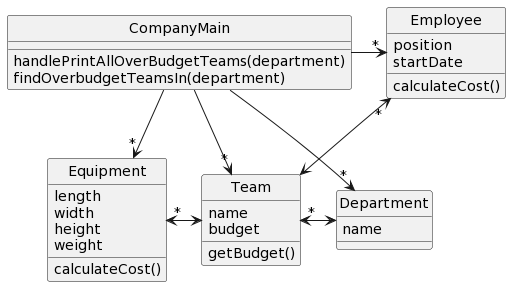

# CSSE 220: Design Problem 4 - Team Budget
At a particular company, departments are composed of named teams and each team has a yearly budget. Teams have both employees and equipment, each of which have a calculated yearly cost.  Employees consist of a position and a start date, and their cost is calculated based on their position and how long they have been in the company.  Equipment consists of dimensions (length, width and height) and weight, which are used to calculate the cost of the equipment due to storage.  A team is over budget if the total yearly cost of all employees and equipment is greater than the team's budget. It should be possible to print a list of all teams within a department that are over budget.

## Bad Design A

[Source PlantUML](http://www.plantuml.com/plantuml/uml/RL3DJiCm3BxtAQATDYJU0A71ne43WWClO1hJMZXkQLnGXNXtt7GBxTHBykdxyHTd7nKwxGCNyOEaXGw2YpemsjbHcPIYP8ZH7PhGWWnFGE9-2kTg4C_uqf7e7VFp5tRtlQzGNn52t7gqOHfGT6VUTn8_Ejx-7OzouVazzHmpcse40XPdRKncrgvfdW4xf_RjpimdzqDekHaGKw9j8YarOZ3jV0H5moLmsRFXGnENuS-UslmAHgcqDl1DFjqrKbNhI2ImFcd-PTUtRdErcMstL2SvBRWMowzP4VEUnPXEp8qfiwQSpcBgEUUMx1x5zu7_0000)

## Bad Design B

[Source PlantUML](http://www.plantuml.com/plantuml/uml/LL1BJiCm4Dtx55PN2L9kW521ikIpu093Cqf6s9FWcO0YrBjZkt5hDl7C-xpORoyAGHVlZ7mIpn30Mz7LOVm6EcR671s8sCV9py3hCn3RNsFj2DmxV0l4Uk_SwpU6XwKVKDyHl3GznZ3roDf6xMdBE5pG7C7WCHxHzD_-4d5faf4axLUsqRYsfkGbiaxwoA9pv6PepzkJdzsq8ie5-5feziX9SIflBAgSEKz2IXF7CRTq0CLAMlnPwv077UFmGtq-HwHXr0Ja8Vdg0hixkxlPLNsOgffkOzFhpFK_6RljDhZSj0RtoFtYtHy0)

