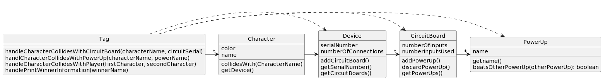
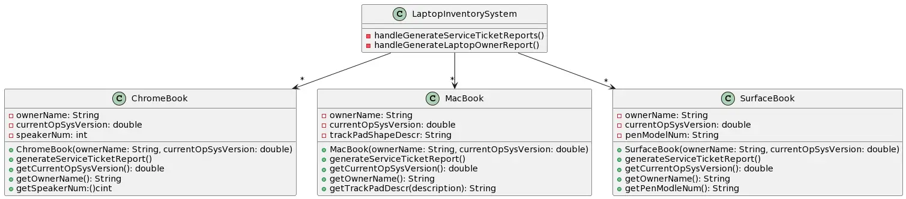

# CSSE 220: Design Problem 5 - Tag and Inventory
***Tag!***
*We are designing a portion of a multiplayer tag game with some interesting features. There are characters and each character is designated a rendering color (blue, red, etc.) and a name. Each character has a “device” that is connected to the character in some way (like on a belt), and these devices have a serial number and number of connections. Devices also have a set of switchable circuit boards contained within that we only need to track the number of inputs on each board and how many of those ports are being used in each board. Characters can collide with other circuit boards in the playing surface and switch them as the new board may have more inputs than the board they currently have. Characters can also collide with power ups on the playing surface, and if there is an open port in the circuit board, the power up can be attached to the device; otherwise, a previous power up can be discarded and the new one may be attached if desired. When characters collide, their power-up combinations determine who “tagged” whom. For simplicity, think of a complex “Paper, Rock, Scissors” type set of rules (or “Paper, Rock, Scissors, Lizard, Spock” if you’re a Big Bang Theory fan) for all the power-ups -- each power-up, or set therein, can beat some and lose to others. The set of rules for the power-ups are not important for our focused design, we simply can identify them by their name, which is enough information for our purposes of deciding who “won” the tag. Also, for simplicity, assume we only need to track the characters, devices, circuit boards and power ups (each with pertinent data); we will not worry about the rendering/drawing parts of the design or the playing surface (which could be 2D or 3D) or even the movement of the characters.*  __**The main issue that needs special attention is that when characters collide, there should be a string to print to the screen from main that says (1) who won the tag (2) what power-ups that character had (3) with what device serial number.**__

## Bad Design A

[Source PlantUML](http://www.plantuml.com/plantuml/uml/RL3Bhjem4DtxAwox2XNm0LrKgEc63I01OZtOGsBLZsZi5274lpU9RJ1NR1Zcp7d4P-K3KEYDPlwliXqG6Ex3JUFmIqfC5w71Utw0vivQi59ZtGA124Yrqrf9z2SLsbgHw5NuxO1a9J9Z0mRdNCJR7ac1daMNZoOxTqKwTj_rdRl6lqcBdyKQRaZLHP4FJyASUnJEoYUGBNQaR3WfQv7MzkB8G53ELjSHILcFzFIdbj-PSDeHis2GYIAxIfmiRJ3ymNzAOFMoYS3WuQSUDhqv8p4xZUsbTjQY6B_1Cv3ohSx9Rr-e8b9oV15KuaDSJbZRhWy-hN4vUfHZMkvzngJo0YW3CISjPKI2HdSmE9B6EH3E2C5lGukKBLonp7xoitCQmR87Eq335x_uru-lLyFirVM2LDE6WH1xOt5aHVb6LYwPa1AdbELajSnMxrWfVhzaYnLQsHlz7m00)

***Laptop Inventory System:***
EIT needs to keep inventory of the laptops from various professors that are currently being serviced by EIT. It is important for EIT to know the current OS version installed so that it can be updated while being serviced, if necessary. Also, EIT must track the laptop's owner. At the end of each workday the manager of EIT wants two different reports generated: 

1.     A *service ticket report* that lists each laptop being serviced and includes: the laptop type (e.g., MacBook, Surface, etc.), its OS version, and its owner
2.     A *laptop owner report* that just lists of all the owners of laptops currently being serviced by EIT

## Bad Design B

[Source PlantUML](http://www.plantuml.com/plantuml/uml/pPF1IiD048Rl-nH3JucQ5-X1YZs8e0QCU14FwsPCGxCpONRIKgJlRkkoL6ZLGY-z9lz-Cz-_x2Ie5HryPrndGu1xsoltTxH0KfPLjGgA7ZuD01GpItM7jqWeLh52MRGEdritHtt2daL3bXy8HcIv99GOYwbBRrlAh3HX39LAIythMmvWrWRCuIsAcfTKN8ykHZ2T2NkyOPx_dtsmxhXWDSY7TP4A1c8ZFqP1h05ug_9eFQR5usStY21fsM_8BoYXPHf3pSDxXmQ-ZNUeR8znzTVvM5ZpU_DPIkXqdvBbYPD2PPg--PKSriau5NQoRkISj-lkpa_tJQnpTPuWrTkN_WK0)
