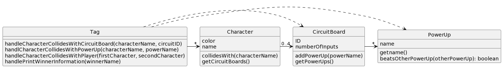
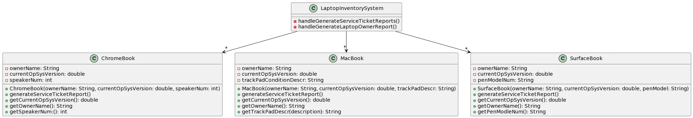

# CSSE 220: Design Problem 5 - Tag (Part 1/2)
***Tag!***
*We are designing a portion of a multiplayer tag game with some interesting features. There are characters and each character is designated a rendering color (blue, red, etc.) and a name. Characters may collide with circuit boards that may be collected (max of 4) and each circuit board has an ID and a total number of ports (ports are used to store power-ups) on each board.  Circuit boards carry power-ups, one per port. Characters can also collide with power-ups on the playing surface, and if there is an open port on any circuit board, the power-up can be attached to a board.  Once the ports are filled, no more power-ups may be added nor any discarded.  When characters collide, their power-up combinations determine who “tagged” whom. For simplicity, think of a complex “Paper, Rock, Scissors” type set of rules (or “Paper, Rock, Scissors, Lizard, Spock” if you’re a Big Bang Theory fan) for all the power-ups -- each power-up, or set therein, can beat some and lose to others. The set of rules for the power-ups are an implementation detail that is not important to our design, we simply need the names of the power-ups of each character to determine which character “won” the tag. Also, for simplicity, assume we only need to track the characters, circuit boards and power-ups (each with pertinent data); we will not worry about the rendering/drawing parts of the design or the playing surface (which could be 2D or 3D) or even the movement of the characters.  When characters collide, the winner name should be printed along with all the names of the winner's power-ups.*

## Bad Design A

[Source PlantUML](http://www.plantuml.com/plantuml/uml/VP0_Ry8m4CLtVmehKwWWwj2f0qA59KjXe68-x2EnwZ_H-IA44D-zG698ggfBOh-xzxjxNaG6ujPP4R-DRu30oSWdYzSl6NMlA0inoYrKPr63rnQNDH0eHbe6Qut6k3DSBmsfrl170DAvIXsVu70gLLShLvEEy2TW4uv8NyrlRnEEtN7ot_IDXHDIVZ0K-T4mbH5LyFeX9CI6ZEUTyHwfz8T03jW4dnzlIZ_hqiT-UELPg6032GyEXHhCJXidQuKyV8oOFsb3_GeiLyAtRe-qFfI-QJaAq3gzGnSy4Njr2EibUUvMgf1l_sl37e7Zcckan0g3o-HTxaEm25vSn1OgEPlBx2Lx9XNFp3CoLSspUVPQ56_PQ7qnl2H6F-AEBUxUOZvsZIgfVO5Ujyx-0000)

# CSSE 220: Design Problem 5 - Inventory (Part 2/2)
***Laptop Inventory System:***
EIT needs to keep inventory of the laptops from various professors that are currently being serviced by EIT. It is important for EIT to know the current OS version installed so that it can be updated while being serviced, if necessary. Also, EIT must track the laptop's owner. Each device comes with an extra as follows:
  - SurfaceBook owners get a pen, for which we track the pen's model number.
  - MacBook owners get a trackpad and the condition of the trackpad should be tracked.
  - ChromeBook owners get an unlimited number of speakers to use with the Chromebook and the number must be tracked.

At the end of each workday the manager of EIT wants two different reports generated: 

  1.  A *service ticket report* that lists each laptop being serviced and includes: the laptop type (e.g., MacBook, Surface, etc.), its OS version, and its owner
  2.  A *laptop owner report* that just lists of all the owners of laptops currently being serviced by EIT with their respective extra device information.

## Bad Design B

[Source PlantUML](http://www.plantuml.com/plantuml/uml/nPBDQZ8n58RtSnN1LURxz0PS5Ac5KgXLEj9zcfngc4mIJZAAbDvxCyOGhVP7X7OpY-ITvvtpd1avpz2tZIguOiwHUsQziNTw1TeRt5GRvw4XhmKXPB1aMYYu1Gt8F5I0AybXBdaD_X6iGUzeUI8OaTEr1emnMfBYhI35wQw1C6izkEhzwv7n4aq3ryRKtsSdZFyiMBNumdYa5hkfSz5kL1BYW0-iWI6fF4gzYCUyHGpWgGtS9q0dZHuIOTfd1J7WBB0wlDasGoArBqXt_3_pwH6u_nMq_n5ORdcBptT0KyAFZx6qJE0KcgRFeMMUD5vLkPcMSPgmjMWiwhvSbqV6wnaJOwE5zE7w1Xp71DdPYrtdgqlm0-Ol2fplzrFHFQNjXip9B3J_bXTBjQ0dHe3gDdTeCfUSRpDH_q3aR5kj80n4zzsDG8ksKUy0)
