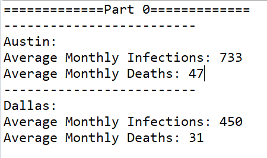
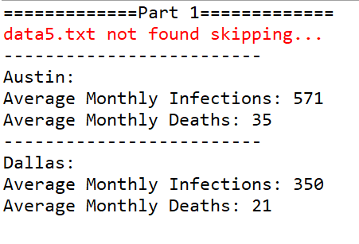
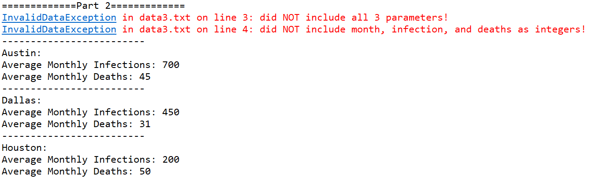
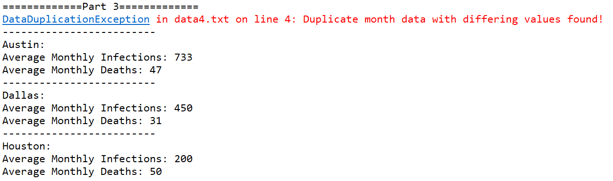
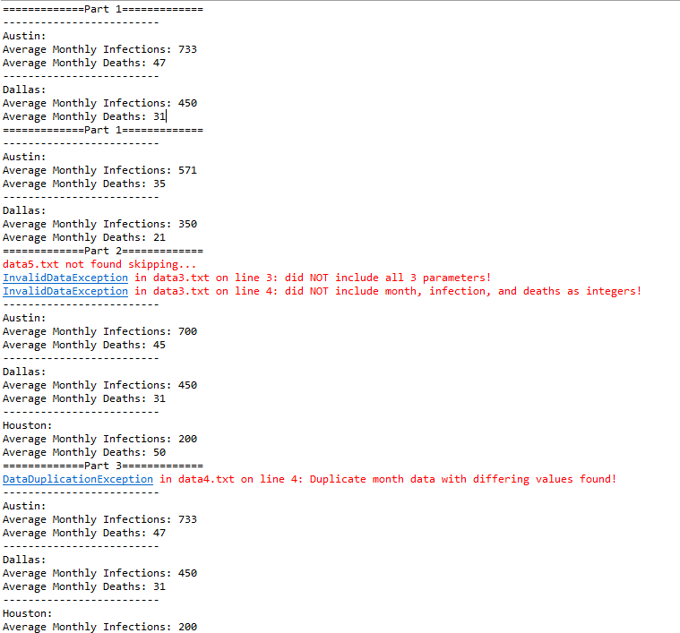

# Exception Homework

This exercise will let you practice throwing and catching Exceptions
to deal with processing data files that cause problems and inconsistencies.
You will do this exercise by yourself.

# Rubric

There are three major exceptions that we ask you to process. 
You will earn 5 points for each part completed.
These can be tested by running the main method in ExceptionHomework.java
and uncommenting the three different stages.

### Note: only run one Part (0/1/2/3) at a time since the System.out and System.err are separate streams and may randomly shift positions between each other.

The problems themselves are already reasonably documented --- don't
worry about writing Javadocs on this program but do keep your code
clean, well formatted, and understandable.

# Instructions

We have some text files that have information that we would like to process.
We have collected data from different sources and our system is 
supposed to deal with some missing data files, errors in formatting, 
and inconsistent data. Once things are processed, it is supposed to
report on each city with the processed information.

Each data file (data1.txt, data2.txt, data3.txt, data4.txt) has information in the format:

		cityName,monthOfYear,infectionsReported,deathsReported,
		
At the moment the code is mostly in place to process the data and generate
a report, and you can do what it does by running the main method. Part 0
should work just fine, as it is reporting on the data from two properly formatted
files.

However, there are a number of problems that can occur without perfect data.
You should apply your understanding of how to throw and catch exceptions to address these.
If you follow the steps in the TODOs it should guide you along the way.

Currently the system is setup so that several problems will crash the program.
There are print statements indicating problems that could happen, but often 
they do not have access to useful information to report on, like what file
and what line number a given problem occurs on.

To keep things manageable, we want to try to handle all of the errors in the 
"processDataFiles" method of ExceptionHomework.java.

As a brief overview, ExceptionHomework.java keeps track of different cities.
As the data is processed each city gets a City object that represents information
collected on the cities from the data files.

## Part 1: Continue processing even with bad filenames

Some of the files in the provided list (filesToRead1) do not exist (data5.txt).
Change the code so that a red warning is printed that states the specific filename(s) that are missing.
To handle this, you will want to catch a FileNotFoundException.
Start by removing the "throws FileNotFoundException" from both main and processDataFiles.
This will force you to put a try catch block around the lines
where a file might not be found. 
(Hint: use System.err.println() to print text in red )

### You should see the following text appear in red when running Part 1 

		data5.txt not found skipping...

---
### Diving Deeper - When `throws` keyword must appear in operation's header
	Checked exceptions are the exceptions that are checked at compile time. If some code within your operation throws a checked exception, then your operation must either handle the exception or it must specify the exception using the throws keyword.

	For example:
	IOException is a checked exception, and FileNotFoundException is an IOException

	So if your operation does not have a *try-catch* for a FileNotFoundException, you would then need to annotate your operation with:  `throws FileNotFoundException`

	On the other hand, if your operation handles the FileNotFoundException, then your operation should not be annotated with  `throws FileNotFoundException`

---

## Part 2: Creating and throwing a custom exception to process at the right place
Some of rows (lines) in the files are incomplete or are improperly formatted,
 which currently crashes the program. This crash happens inside of City.java 
 because of an ArrayIndexOutOfBoundsException (not enough data) or NumberFormatException
 (when a non-number is provided). In other words, the parser expects 3 ints: month, infections, deaths.
There are code comments to indicate what should happen and what kind of message to diplay.

When these errors occur, we do not want to trust that particular line to do calculations,
however, there might be other data we DO want to use. So, that specific line should NOT be
used to add any data and it SHOULD provide a warning to the user. However, the program
should continue to move through the current file reading more information. Since the particular 
type of error has a different nature than other Exceptions that already exist, we will 
need to create our own type of Exception called an InvalidDataException. We want to throw
an InvalidDataException to indicate that this file had an invalid line.

To create this new custom type of exception is very simple, just create a new class like so:

		public class InvalidDataException extends RuntimeException{  
			InvalidDataException(String s) {
				super(s);
			}
		}

to then throw it, we can do

		throw new InvalidDataException("some message");

#### Note that we pass in a String when we define it!
This is a message associated with it and can be accessed later by using
e.getMessage()  (where e is the variable referring to the InvalidDataException).

### You should see the following text appear in red when running Part 2

		InvalidDataException in data3.txt on line 3: did NOT include all 3 parameters!
		InvalidDataException in data3.txt on line 4: did NOT include month, infection, and deaths as integers!

## Part 3 - Creating and throwing a custom Exception to process at the right place
Sometimes when reading through the files there might be duplicate entries in 
which the date and city are the same.

If the number of infections and deaths are identical, then we should just keep 
the original data (no warning needed). However, if either are DIFFERENT then 
something is VERY wrong and we should *STOP parsing the current file* and warn the user of the issue.
(For simplicity, it is OK to keep any data processed up to this point in the file)

### You should see the following text appear in red when running Part 3

		DataDuplicationException in data4.txt on line 4: Duplicate month data with differing values found!

#### Hint: you need to create another class called DataDuplicationException using the same process as before.
#### Hint: you will want to process the custom exceptions in Part 2 and 3 in separate places to provide the desired functionality

#### Hint: Only run one part at a time, since System.err and System.out are separate and can intermix:

