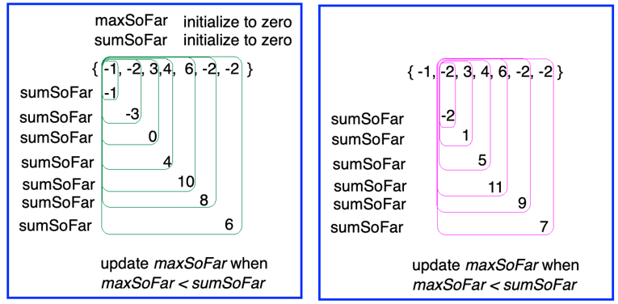

# HW12

## Overview:
- This assignment gives you practice writing recursive operations, both directly and as recursive helper methods. 
- The *recursion* package contains unimplemented methods.  
- Simply implement each of these operations using recursion (no loops!). 
- Some problems require you to implement a (private) recursive helper method. It is up to you to determine whether to use recursion directly or via a helper method. 
- When you use a helper method, you still CANNOT use loops in either the public method or the helper method.  
- This is an individual exercise/assignment. 

## Rubric:
To earn credit for this assignment:
- all JUnit tests for each operation must succeed, AND
- you must not use any loops. 

## To do:
1. Implement the methods in *HW12.java*
2. Run the included *RunAllTests.java* to ensure your solution passes all the unit tests
3. Upload your completed *HW12.java* file to the Gradescope dropbox

- There are no documenting/commenting requirements for this assignment, but feel free to add in-line comments to help you keep track of your base case(s) and recursive call(s).

## Notes:
- You should NOT use ANY kind of loops (while, for, enhanced-for, etc.). Every problem must be solved using recursion.
- If you use loops in your solution, you will not earn credit even if you pass all tests.
- The specification of what to do for each method appears as a Javadoc comment above the method.
- If needed, create and implement a private recursive helper method; call the corresponding helper from the public method.  
- Since the provided operations are the ones that a client would call in order to get the work done, declare each helper method as `private` so a client cannot call the helpers directly. (This is a good software engineering practice.)

## Hint:
The last problem is a good challenge.
The following image might be helpful in guiding you to see a way to approach it.

