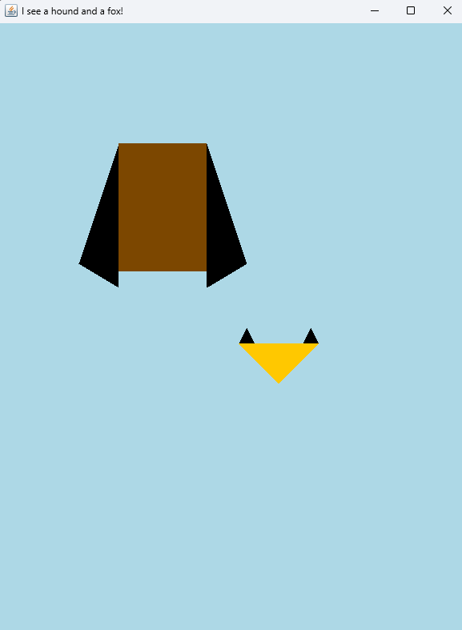

# HW7: The Fox and the Hound 

## Overview:
- This exercise is intended to give you practice with Java Swing graphics
- You may work in pairs or individually on this assignment

## Rubric:
To earn credit for the assignment, your *FoxViewer.java* and *HoundViewer.java* must draw each of the images *similar* to the provided samples. 

## To do
1. Finish implementing the `drawOn` method in the *Fox* class. 
2. Implement the *Hound*, *HoundViewer*, and *HoundComponent* classes from scratch. 
3. Upload all your Java files to the assignment dropbox. 

## Step 1: `drawOn` method for the *Fox* class
- Review the provided *Fox*, *FoxComponent*, and *FoxViewer* classes. 
- In the `drawOn` method of the *Fox* class, add code to create Polygon objects for the face and ears and draw them to the screen with the appropriate colors.
- When you run *FoxViewer.java*, you should see an image similar to the one below:
- 

## Step 2: The *Hound* class and its viewer and component classes
1. Create the *Hound* class, which will represent a hound dog.
   - Add a brief Javadoc comment to the class. 
   - The *Hound* class should have constants for the colors and dimensions of the hound, similar to the *Fox* class.
   - A hound's height and width are fixed at 160 pixels and 110 pixels, respectively.
   - A hound's ears are scalene triangles: the long side is flat against the sides of the face, extending 20 pixels below the bottom of the face. The third point is 30 pixels up from the bottom and 50 pixels out.  
   - A hound's ears are always colored black (`Color.BLACK`).  
   - The *Hound* class should have a constructor that takes the x and y coordinates of the upper-left corner of the hound's body and a color for the hound's face.
   - The x and y coordinates of the hound represent the upper-left corner of the hound's face. 
   - The *Hound* class should have a `drawOn` method that draws the hound given a `Graphics2D` object.
2. Create the *HoundComponent* class, which extends `JComponent`.
   - Override the `paintComponent` method.
   - Near the start of `paintComponent`, fill the entire background with light blue (your choice of RGB values). Hint: you can use the `fillRect` method or create a `Rectangle` object and fill it. 
   - Then, draw a hound (using the *Hound* class) at (x, y) = (150, 150). Its face color should be brown (RGB values 124, 71, 0).
   - Have the `paintComponent` method also draw a *Fox* with coordinates (300, 400) and a face color of `Color.ORANGE`.
3. Create the *HoundViewer* class, which contains the `main` method. 
   - The *HoundViewer* class should create a `JFrame`, set its size to 600Wx800H pixels, and add an instance of *HoundComponent* to the frame.
   - Set the default close operation and make the frame visible, as in *FoxViewer.java*.

When you run *HoundViewer.java*, you should see an image similar to the one below:

## Step 3: Uploading your work
- Make sure all your Java files are in the `src` folder of this project.
- Upload all your Java files to the assignment dropbox. 

## Optional - Further Swing Graphics Practice
For additional practice with Java Swing graphics, see [the old HWScenes assignment](https://github.com/RHIT-CSSE/csse220/tree/master/Homework/HWScenes). You can follow the instructions for that assignment by creating new classes in this project's `src` folder.  
