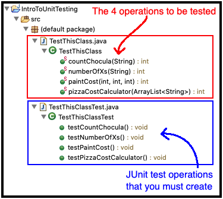

# HWIntroToUnitTesting

## Overview:
- Intro To Unit Testing will provide practice at creating JUnit unit tests for preexisting code
- This is an individual exercise/assignment

## Rubric:
To earn a 100% for the assignment:
1. You must submit the file *TestThisClassTest.java*
2. *TestThisClassTest.java* must contain these 4 JUnit test operations: *testCountChocula*, *testNumberOfXs*, *testPaintCost*, *testPizzaCostCalculator*
3. Each JUnit test operation must contain 4 test cases (see details below in the Additional Notes and Detailed Rubric sections)

## To Do:
1. In Eclipse, import this project (HWIntroToUnitTesting) from your local copy of the CSSE220 repo
2. Create a JUnit test file called *TestThisClassTest.java* (see screen shot below)
3. In *TestThisClassTest.java*, create unit test operations for the 4 operations that appear in *TestThisClass.java*. 
 These unit tests must reveal which of the 4 operations are defective
4. Upload your completed *TestThisClassTest.java* file to the IntroToUnitTesting Moodle Dropbox

## Additional Notes:
- Each of the 4 operations to be tested has a Javadocs comment that specifies its functional behavior
   - Read these comments to understand what the operation is *supposed* to do
- Three of the 4 operations to be tested have defects
   - You are *not* to correct any of these defects
   - The purpose of testing is to expose defects
- In each JUnit test operation, supply at least 4 different test cases for the operation under test
   - One of the 4 test cases must reveal a defect, *if* the operation under test is defective
   - Add a comment to each of the 4 test cases that indicates how it tests something different than the others
- For example in *testCountChocula*, supply at least 4 different test cases that test *countChocula*
   - And if *countChocula* is defective, then 1 of those 4 test cases must reveal a defect, i.e., must not pass
- All test inputs must be *legal* test inputs for the operation that is under test
   - That is, the input must be one that the operation *should* handle correctly if it were implemented without defects
- Also, for these operations, it is not fair to pass in a <code>null</code> to operations expecting an actual object reference

### Detailed Rubric:
 - (-5) for missing comments on ALL tests, scale down if it's just for a method. (-1 for one method, -3 for 2... comments are a big deal!)
 - (-2) if missing comments on the defects, but have comments otherwise
 - (-2) if missing comments for other tests, but have comments on defects
 - (-3) if pass in NULL as a test case despite being explicitly told not to above
 - (-2) for other invalid inputs (Longs instead of ints, integer limits for paintCost)
 - (-4) if missed more than 1 defective method (there are three total)
 - (-5) f missing @Test before any of the method's testing cases. (Tests won't even run without it)
 - (-1) for bad test case examples such as miscalculations
