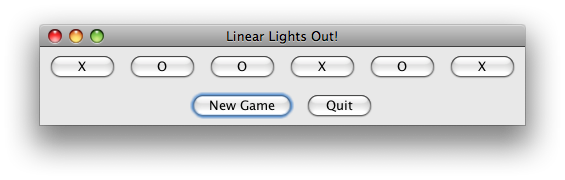

# HWLinearLightsOut

## Overview:
- This exercise will provide more practice with event based programming in Java Swing
- There is an individual part and a paired part (details are below)

In this assignment, you will practice with event-based programming. This is a _Pair Programming_ assignment: you will work in a team of two, alternating Navigator and Driver roles. 

There is a _Manual Part_, which you must complete without external resources beyond the Java API Docs and CSSE 220 course materials. Then, there is a _GenAI Part_, in which you will draft a UML design, use a GenAI tool to assist your implementation of that design, and write a brief report on the experience. 

You and your partner should write all code on one of your machines, then send the final version (after submission) to the other person via email or Teams for future reference. If you split the work across more than one session, consider sending intermediate versions of the code too. 

## Content Learning Targets
_After completing this assignment, you should be able to say:_
- I can explain how Java Swing uses events and event listeners to support interactive GUIs. 
- I can apply event-based programming techniques to build interactive Java Swing GUIs. 
- I can manually test Java Swing GUIs by checking for correct behavior, especially on edge cases and/or "bad" user actions. 
- I can review code that I didn't write with respect to design principles and documentation/style guidelines. 

## Process Skill Goals
_During the activity, you should make progress toward:_ 
- Forming shared understanding of system requirements with a teammate. (Teamwork)
- Writing reflections with technical detail on the software development process. (Communication)

## Rubric:
To earn full credit for the assignment, you must successfully complete the following tasks:

1. (30% of grade) *Manual Part - Ball/Strike Counter* you must add the ball and strike buttons and handle clicks on the buttons correctly (see details below)
2. (10% of grade) *GenAI Part - Linear Lights Out - Functionality* you must allow the user to choose the number of buttons to be displayed and correctly handle clicks on all of the app's buttons (see details below)
3. (30%) *GenAI Part - Linear Lights Out - Report* you must complete the report template in [LinearLightsOutReport.docx](./LinearLightsOutReport.docx). To earn full credit, answer every question with serious, thoughtful responses, using complete sentences (except in diagrams). 
4. (10% of grade) *Commenting & Conventions*, following the style guidelines in [the CSSE 220 Grading Guide](../../Docs/grading_guide.md), including Javadoc comments for classes and methods. Use the provided *BankAccount.java* as a guiding example. Delete all of the TODO comments as you complete each TODO. 

## To Do:

1. In your IDE, import this project (HWLinearLightsOut) from your local copy of the CSSE220 repo
2. Implement the *Manual Part - Ball/Strike Counter* (details below)
3. Complete the *GenAI Part - Linear Lights Out* (details below)
4. Upload your team's completed *.java* files and report to the LinearLightsOut dropbox. Make sure the submission includes both team members. 

## Part 1 - Manual Part: Ball/Strike Counter
### Overview
Implement the code in the *ballStrikeCounter* package. In this starter project you have been give simple GUI framework for a program 
that tracks balls and strikes for a baseball game. You need to add the buttons, ActionListeners, and variables necessary to make the code function correctly.
You may add any new classes or make any changes you feel necessary. The method for properly displaying the label in the app (which uses some basic HTML formatting) has been provided for you in the *updateLabel* method. 

### Part 1 To Do:
1. Make the "Add Ball" and "Add Strike" buttons appear in the app's window as shown in the screenshot below. 
2. The buttons must work as follows: 
    - When clicked, the *Add Ball* button adds a 1 to the Balls count. If the *Add Ball* button is pressed when the current count has 3 balls, then both the Balls count and Strikes count must be reset to 0. 
    - When clicked, the *Add Strike* button adds 1 to the Strikes count. If the *Add Strike* button is pressed when the current count has 2 strikes, then both the Balls count and Strikes count must be reset to 0. 
    - The label should be updated to reflect the new ball/strike counts every time a button is clicked. 

 

## Part 2 - GenAI Part: Linear Lights Out
### Game Overview
1. You will implement the app Linear Lights Out in the *linearLightsOut* package. 
2. The app presents the user with an array of buttons that are randomly initialized to either Xs or Os, using a 50% probability. 
3. Clicking on a button changes the symbol of the clicked-on button and *both its left and right neighbors*, if those neighbors exist. For example, a click on a button with the label 'X' changes it to an 'O', and flips the left and right neighbors' symbols similarly. 
4. Buttons on the end just change their own symbol and their one neighbor's symbol; the end buttons do not "wrap around". 
5. The goal of the game is to reach a state where all the buttons show the same symbol, either all Xs or all Os, it doesn't matter which. 
6. When that happens the user *wins* and the game is over. 
### Quick Notes
- This starter package is providing less *scaffolding* for getting you started, but everything you need to solve the problem has either appeared in previous homework or examples, or is in the Java API documentation for *JButton*. 
- Take the design phase seriously; the quality of your initial UML design will greatly affect the quality of the GenAI-produced code. 
- Remember to ask for help if you get stuck. 

Here's a screenshot of the game in progress:
 

Here's a screenshot of a game that was won with all Xs:
 

And here are some basic game requirements: 
- Display a frame with the right title. 
- Display the right number of buttons in the frame (see the nButtons variable in *LinearMain.main*) without worrying about event handling or the symbols on the buttons. (For full credit, your final solution must work with any *nButtons* greater than 2.)
- Make sure the buttons are initialized to random symbols (Xs and Os, 50% probability each). 
- Implement a working Quit button (This involves implementing an event handler for the Quit button). 
- Implement a working New Game button. When the button it pressed, the game should reset the symbol buttons to a new set of random symbols. 
- Set up event handlers for the symbol buttons that correctly toggle the symbols as described above. 
- Check for a win and notify the player in some way through the GUI (not simply by System.out.println). Changing the window title would suffice; be sure to change it back when the player clicks *New Game*. 

### Design Phase: Plan with UML
Examine the main method in the LinearMain class in the linearLightsOut package. This is all the starter code provided for this game. 

Prepare ***at least two*** designs (UML class diagrams) for the LinearLightsOut game, using *LinearMain.java* as a starting point. 

- As a hint, you will need to consider these design decisions: what event listeners will you need? And how will they access the needed data and/or methods? Will your custom class(es) extend JFrame, JPanel, JButton, or nothing? 
- Normally we don't include built-in Java classes in our UML, but if you choose to extend a Swing class, add it (just the name of the class, no fields/methods) to your UML for clarity. 
- Brainstorm your designs with whiteboard/paper/PlantUML, then create at least two contenders in PlantUML. These will be included in your report. 

### Implementation/Testing Phase: Write/test code with GenAI
Using a GenAI chatbot tool of your choice, give it one of your UML designs for Linear Lights Out, along with appropriate context, and prompt it for an implementation of your design. Refer to the [CSSE 220 Prompting Guide](../../Docs/prompting_guide.md). 

Compare the GenAI-produced solution against your UML. How closely does the implementation match your design? Take note of any significant additions/changes, and consider prompting the GenAI tool to explain certain implementation decisions. 

Test out the GenAI-produced solution by manually playing the game. Try to cover edge cases and anticipate "bad" user behavior. For any bugs you encounter, try fixing them manually. If you get stuck, prompt the GenAI tool to fix the bug, providing sufficient detail of what went wrong and what you think might be the root cause. 

### Evaluation Phase: Assess the Quality of your LLO Implementation
Evaluate your GenAI-assisted Linear Lights Out implementation using our [Object-Oriented Design Principles](../../Docs/Handouts/Basic_OO_Principles_for_CSSE220.pdf) and [documentation/style guidelines](../../Docs/grading_guide.md). If you find significant design flaws, look back at your original UML design. In hindsight, can you see the design flaws in your UML? 

If you are happy with your design and implementation, move on to the Experimentation Phase. Otherwise, go back to the Implementation/Testing Phase with one of your other UML designs, or an improved UML design based on the design flaws you found. 

### Experimentation Phase: Customize Your LLO Game
Customize your Linear Lights Out game by adding at least one new feature. (You are allowed to use GenAI assistance to implement the new feature.) Here are some ideas, but please feel free to come up with your own. 
- Change the colors of the buttons (in addition to their text) to indicate on/off, possibly changing the frame's background color too. 
- Add a label/panel at the top that keeps track of how many games you've won so far, and/or your record for fewest moves (clicks) needed. 
- Customize the look and feel. For more info on Swing look and feel, see [Oracle's documentation](https://docs.oracle.com/javase/tutorial/uiswing/lookandfeel/plaf.html). For a fancier option, see [FlatLaf](www.formdev.com/flatlaf/), which requires adding a dependency to the project in your IDE.  

Once you have selected your new feature(s), work your way through the Experimentation Phase section of the report. 

### Reflection Phase: Summarize What You Have Learned
Complete the Reflection Phase section of the report. 

## Hints:
1. *JButton*'s *setText()* and *getText()* methods are your friends, use them. 
2. You do not need to use inheritance to solve this problem. 
3. You may, however, use inheritance in this project if you wish: extending JFrame, JButton, and/or JPanel, for example. 
4. Correct ALL compiler warnings: those warnings are telling you that something is incorrect about your code. 

