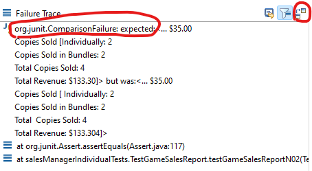
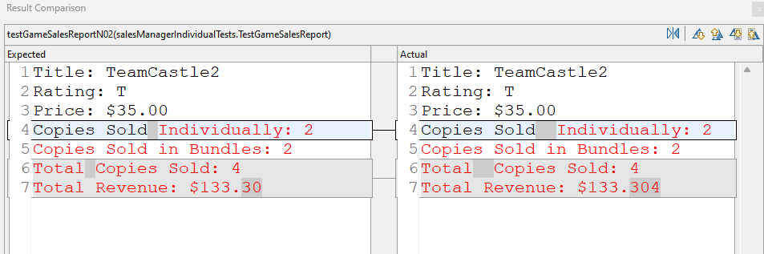

# HWVaporSalesManager - Implementing Design Problem 2

## Overview: 
In this assignment, you will implement the sales manager for Vapor video games (Design Problem 2). There is an _Individual Part_, which you must complete alone, and a _Paired Part_, which you can work on either alone or with one partner. If you work with a partner on the *Paired Part*, then add a comment with your partner's name at the top the files you submit. 
## Learning Objectives: 
After completing this assignment, you will be able to:
- Implement a set of classes given their UML diagram. 
- Develop new objects, complete with fields and methods. 

## Rubrics:
To earn a 100% for the assignment you must do the following 3 tasks:
1. (60% of grade) *Individual Part*
2. (30% of grade) *Paired Part*
3. (10% of grade) *Commenting & Conventions*

### 1) Individual Part Rubric
To earn a 100% for this part, all JUnit tests for the *Individual Part* operations must succeed 
- Your score for the *Individual Part* of the assignment = (PercentageJUnitTestsPassed * IndividualPartTotalPoints)

### 2) Paired Part Rubric
To earn a 100% for this part, all JUnit tests for the *Paired Part* operations must succeed 
- Your score for the *Paired Part* of the assignment = (PercentageJUnitTestsPassed * PairedPartTotalPoints)

### 3) Commenting & Conventions Rubric
To earn 100% for *Commenting & Conventions*, you must do the following:
- The code in each file must being well formatted - Use Eclipse's *Format* command on the *Source* menu (shortcut: `Control+Shift+F` )
- Use conventional Java variable naming conventions
- Provide meaningful variable names
- Add Javadoc *class-level* comments at the top of each class: SalesManager, Game, and Bundle

## To do:
1. In Eclipse, import this project (HWVaporSalesManager) from your local copy of the CSSE220 repo. 
2. Modify the classes SalesManager, Game, and Bundle to implement the required functionality. You may use your own DP2 solution, or you can refer to [our UML](./DP2_Solution.png). 
3. Run the included JUnit tests to ensure your solution passes all the unit tests - do this by running *RunAllIndividualTests.java* and *RunAllPairedTests.java*
4. Each student uploads her or his completed *.java* files to this assignment's Dropbox

Upload *Game.java*, *Bundle.java*, and *SalesManager.java*

## Notes
### The Individual Part (required to be done individually)
In this program, you are implementing a video game sales manager for Vapor, a hypothetical digital game distributor. This application will keep track of sales of games and game bundles.  From the [Design Problem 2 instructions](../DesignProblems/DP2/DP2.md):

> Vapor, the popular video game digital store, has hired you as a consultant to design a sales management application. Each game available to purchase through Vapor has a title, ESRB rating (e.g., "T" for "Teen"), and price, all of which are fixed. You may assume game titles are unique. 
> 
> Vapor also sells game _bundles_, which complicates their sales records (hence why they hired you instead of designing the application themselves). Each bundle is a set of games with a clever name (e.g., "Boom Bundle 2") and price (less than the sum of the individual game prices) determined in advance by the marketing team. Every bundle contains at least two games, and a game may appear in more than one bundle. You may assume bundle names are unique. 
> 
> For any given bundle, Vapor wants to be able to generate a report including the bundle's name, price, included game titles, how many times the bundle was purchased, and the total revenue from that bundle. 
> 
> Also, Vapor wants to be able to produce a sales report for each game, including how many times the game has been sold individually or as part of a bundle (e.g., "TeamCastle has sold 27 copies individually and 44 copies as part of a bundle"). 
> 
> The game's sales report should also include the total revenue from that game. For computing total revenue, Vapor distributes the sales price of each bundle evenly across all games in the bundle. For example, a bundle of four games sold for $60 should count as $15 of revenue for each game. 
> 
> Finally, Vapor wants a method to determine the game with the highest total revenue and a method to determine the most popular (i.e., most copies sold) bundle. 

To run this app, right click on the file *SalesManager.java* and choose *Run As* | *Java Application*

The interface for this program is entirely text based and the example input/output (below) will give
you an idea of how the program will work. The green\* text is user input, and the rest of the text is the program output:

\**GitHub may not show this text as green, but if you copy/paste the raw Markdown content of this README into [Markdown Live Preview](https://markdownlivepreview.com/), the green text will be green.*

<pre>
Welcome to the Vapor Sales Manager.  Enter commands.  Type 'exit' to end. 
add-game MoonCraft E 27.49
ok
add-game TeamCastle2 T 35
ok
add-game TowerRise E10+ 45.49
ok
add-game Limitl3ss M 60
ok
add-game KangarooJane T 39.95
ok
print-game-sales-report TowerRise
Title: TowerRise
Rating: E10+
Price: $45.49
Copies Sold Individually: 0
Copies Sold in Bundles: 0
Total Copies Sold: 0
Total Revenue: $0.00
add-bundle BuilderBundle 75 MoonCraft TowerRise
ok
add-bundle BoomerangBundle 100 TowerRise Limitl3ss KangarooJane
ok
sell-game MoonCraft
ok
sell-game KangarooJane
ok
sell-bundle BuilderBundle
ok
print-game-sales-report MoonCraft
Title: MoonCraft
Rating: E
Price: $27.49
Copies Sold Individually: 1
Copies Sold in Bundles: 1
Total Copies Sold: 2
Total Revenue: $64.99
exit
</pre>

Note that the total revenue for MoonCraft is determined by adding the individual sales revenue, (1 copy) x ($27.49 per copy), to the bundle revenue portions, (1 BuilderBundle) x ($75 per BuilderBundle) / (2 games in BuilderBundle). 

The good news is that the difficulty of dealing with the text based input and output of the program has all been done for you. All you will have to write is the code to update the program's games, bundles, and sales records, as well as generate sales reports. 

To solve this problem, you will modify 3 classes. 
1. An instance of the `Game` class will keep track of a game's title, rating, price, and number of copies sold. 
2. An instance of the `Team` class will keep track of a bundle's name, which games are in the bundle, the bundle's price, and how many copies of the bundle have been sold. 
3. The `SalesManager` class will store a list of all `Game` objects and a list of all `Bundle` objects, as well as handling input/output. 

To make things work, you'll need to write code for the following commands:

- `add-game [title] [rating] [price]`: creates a new `Game` object with the given info

Implement this by writing the `handleAddGame` method in `SalesManager.java`, plus anything you need to add to the `Game` class. 

- `add-bundle [name] [price] [gameTitle1] [gameTitle2] [...] [gameTitleN]`: creates a new `Bundle` object with the given info, where `N` is the number of games in the bundle

Implement this by writing the `handleAddBundle` method in `SalesManager.java`, plus anything you need to add to the `Bundle` class. 

- `sell-game [title]`: adds one to the number of copies sold for the `Game` with the given title

Implement this by writing the `handleSellGame` method in `SalesManager.java`, plus anything you need to add to the `Game` class. 

- `sell-bundle [name]`: adds one to the number of copies sold for the `Bundle` with the given name

Implement this by writing the `handleSellBundle` method in `SalesManager.java`, plus anything you need to add to the `Bundle` class. 

- `print-game-sales-report [title]`: prints a sales report for the `Game` with the given title. 

Implement this by writing the `handlePrintGameSalesReport` method in `SalesManager.java`, plus anything you need to add to the `Game` class. 

The report should look like:
<pre>
Title: TeamCastle2
Rating: T
Price: $35.00
Copies Sold Individually: 120
Copies Sold in Bundles: 100
Total Copies Sold: 220
Total Revenue: $6700.00
</pre>

- `print-bundle-sales-report [name]`: prints a sales report for the `Bundle` with the given title. 

Implement this by writing the `handlePrintBundleSalesReport` method in `SalesManager.java`, plus anything you need to add to the `Bundle` class. 

The report should look like: 
<pre>
Name: BoomerangBundle
Games: TowerRise,Limitl3ss,KangarooJane
Price: $100.00
Copies Sold: 4
Total Revenue: $400.00
</pre>

> [!NOTE]
> **Tip:** If you are having trouble matching the expected sales report formats, use Eclipse's expected vs. actual comparison tool. 
> In the lower-left "Failure Trace" view, double-click on the comparison failure (circled in screenshot below) for the failed test case, or click on the "Compare Actual With Expected Test Result" button (also circled). 
> Eclipse will then show you a side-by-side comparison of the expected and actual test results (second screenshot below). 
> This can help you find missing/extra whitespace and other small formatting errors. 

Some additional details and hints are provided in the comments of the methods themselves. 

Unit tests for these methods have been provided. 

### The Paired Part (optionally do with a partner)

For this part, you may work with a single partner, or alone. Both you and your partner should make clear who you worked with in the comments so there is no issue of plagiarism. Also, although you can work together and help each other, your code for the _Individual Part_ should not be identical. As a result, you may have to write slightly different code for the _Paired Part_. 

We highly recommend that you seek out a partner to collaborate on part. 

Why? Because you will be working on a multi-week project with at least 1 partner toward the end of this quarter. Now is a good time to find someone you can work with.

#### Paired Part Tasks
1. Implicitly create games if they appear in an `add-bundle` command but do not yet exist. The default price (if purchased individually) for a new game should be 49.95 USD, and the default rating should be "T". 
2. Implement the `handleGetBestSellingBundle` method in `SalesManager.java`, which will be called when the user enters the `best-selling-bundle` command. Remember that "best-selling" means most copies sold, not highest total revenue. 
3. Implement the `handleGetHighestRevenueGame` method in `SalesManager.java`, which will be called when the user enters the `highest-revenue-game` command. Remember that the total revenue for a game includes any revenue portions earned from selling bundles including that game. 

Example: 

<pre>
Welcome to the Vapor Sales Manager.  Enter commands.  Type 'exit' to end. 
add-bundle ImplicitBundle 94.96 DeadMitochondria CallOfDestiny
ok
sell-game DeadMitochondria
ok
sell-game CallOfDestiny
ok
add-game VertebrateCrossing E 39.99
ok
add-bundle MixedBundle 78.24 CallOfDestiny VertebrateCrossing
ok
sell-bundle ImplicitBundle
ok
sell-bundle MixedBundle
ok
sell-bundle MixedBundle
ok
best-selling-bundle
MixedBundle
print-bundle-sales-report MixedBundle
Name: MixedBundle
Games: CallOfDestiny,VertebrateCrossing
Price: $78.24
Copies Sold: 2
Total Revenue: $156.48
highest-revenue-game
CallOfDestiny
print-game-sales-report CallOfDestiny
Title: CallOfDestiny
Rating: T
Price: $49.95
Copies Sold Individually: 1
Copies Sold in Bundles: 3
Total Copies Sold: 4
Total Revenue: $175.67
exit
</pre>

