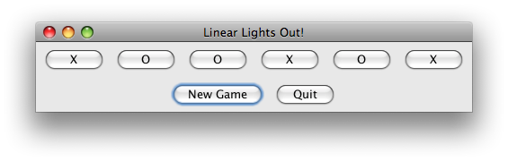

# CSSE 220 Object-Oriented Software Development
## Ball/Strike Counter and Linear Lights Out
### Objectves
More practice with event-based programming in Swing. This has an Individual Part and a Pair Part.

### Individual Part
**Ball/Strike Counter: This part is to be done individually.**
Implement the code in the *ballStrikeCounter* package. We gave you a
simple GUI framework for a program that tracks balls and strikes for a
baseball game. You need to add the buttons, ActionListeners, and
variables necessary to make the code work. You may add any new classes
or make any changes you feel necessary. The method for properly
displaying the label has been provided for you in the updateLabel
method.
1. **Points (20 points)**
     * **5 points** - The Add Ball and Add Strike buttons appear in
       the window as shown in the image.
     * **15 points** - The buttons should work as follows: **Add
     Ball** adds a ball to the count. If the count reaches 4, the
     count of both the balls and strikes should reset to 0. The label
     should be updated to reflect the new ball/strike counts. **Add
     Strike** adds a strike to the count. If the count reaches 3, the
     count of both of the balls and strikes
     should reset to 0. The label should be updated to reflect the new ball/strike counts.  

 

### Pair Part
**Linear Lights Out. You may work with a single classmate of your
choosing on this part. You may sit together while you work and discuss
ideas and code freely, but each person must type and submit their code
to their own repository.
If you do this, please identify the classmate in a comment at the top of your program.**  

Implement the game Linear Lights Out in the *linearLightsOut*
project. In Linear Lights Out, the user is presented with an array of
buttons that are randomly initialized to either Xs or Os, 50%
probability each. Clicking on a button changes the symbol of the
button *and both its left and right neighbors*, if they exist. Buttons
on the end just change their own symbol and their one neighbor's
symbol; the buttons don't "wrap around". The object of the game is to
reach a state where the buttons all show the same symbol, whether Xs
or Os, it doesn't matter.

We're providing a lot less "scaffolding" for this problem than most of
the previous ones. Everything you need to solve the problem has either
appeared in previous homework or examples, or is in the Java API
documentation for *JButton*.
Remember to ask for help if you get stuck.  

Here are the various stages you should complete:
- **Stage 0:** Examine the main method in the LinearMain class in the linearLightsOut package in the LinearLightsOut 
project that you checked out in class. This is all the code that we supply for the project: the rest is your responsibility.
- **Stage 1:** Display a frame with the right title.
- **Stage 2:** Display the right number of buttons in the frame (see the nButtons variable in *LinearMain.main*) 
without worrying about event handling or the symbols on the buttons. For full credit, your final solution must 
work with any *nButtons* greater than 2.
- **Stage 3:** Make sure the buttons are initialized to random symbols (Xs and Os, 50% probability each).
- **Stage 4:** Implement a working Quit button (This involves implementing an event handler for the Quit button).
- **Stage 5:** Implement a working New Game button. When the button it pressed, the game should reset the symbol 
buttons to a new set of random symbols.
- **Stage 6:** Set up event handlers for the symbol buttons that correctly toggle the symbols as described above.
- **Stage 7:** Check for a win and notify the player in some way through the GUI (not simply by System.out.println). 
Changing the window title would suffice. (If you do that, be sure to change it back when the player clicks *New Game*.)

#### Hints
1. The *setText()* and *getText()* methods of JButton are your friends.
2. You do not need to use inheritance to solve this problem; your BallWorlds project will give you practice with that.
    * You may, however, use inheritance in this project if you wish: extending JFrame, JButton, and/or JPanel, for example. 
But usually this is not helpful.

Here's a screen shot of the game in progress:

### Remember, in all your code:

- Write appropriate comments:  
  * Javadoc comments for public fields and methods.
  * Explanations of anything else that is not obvious.
- Give self-documenting variable and method names:
    * Use name completion in Eclipse, Ctrl-Space, to keep typing cost low and readability high.
- Use Ctrl-Shift-F in Eclipse to format your code.
- Take care of all auto-generated TODO's.
    * Then delete the TODO comment.
- Correct ALL compiler warnings.
    * Quick Fix is your friend!
 1. **Points - 10 points for each stage**
    - **-5 points** - The windows does not automatically size for the number of buttons entered
    - **-5 points** - The new game button does not reset the game won notification (if applicable)
 2. **Total: 70 points**
 
**Total for both parts: 90 points**

