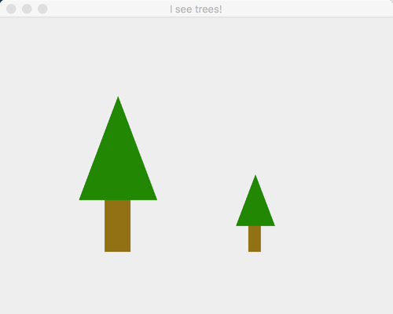
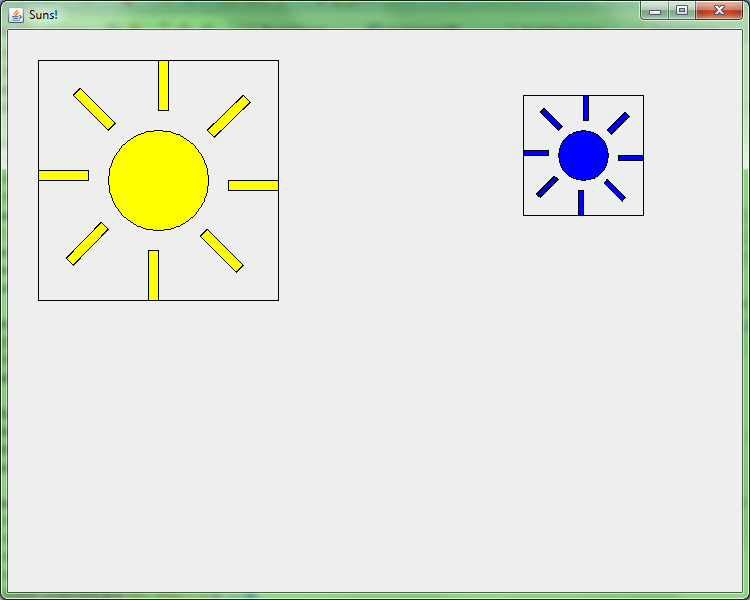
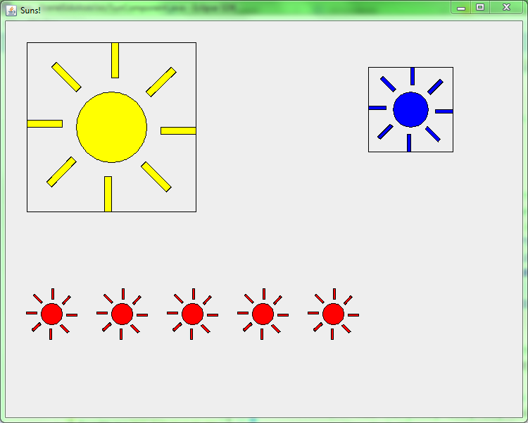
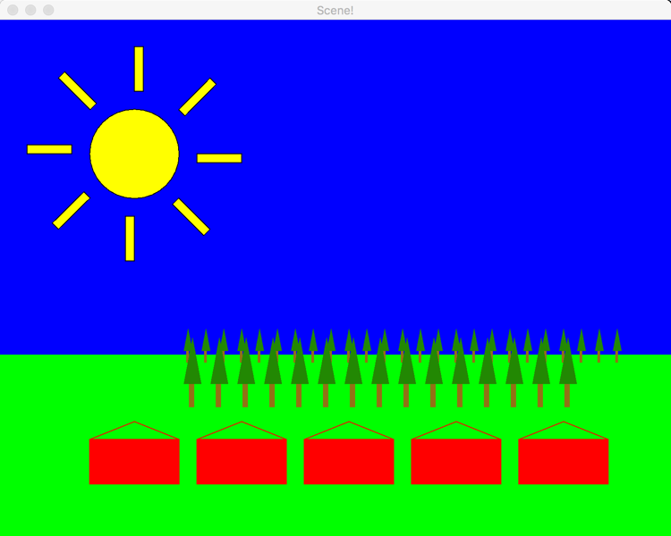

# Scenes Assignment

# Grading rubric 

* Stage 1 (Houses) works as specified: 10 points. 
* Stage 2 (Trees) works as specified: 10 points. 
* Stage 3 (Sun) works as specified: 15 points. 
* Stage 4 (Scene) works as specified: 15 points. 
* Stage 5 (Rotating Faces) works as specified: +15 points BONUS. 

So 50 points is a perfect score, but you may earn up to 65/50 points if you do the BONUS as well.

# Stage 0. Study your goal.

In the final stage, you will draw a scene consisting of some houses, trees, a sun, and the sky and grass in the background:

You will draw the houses, trees, and sun in isolation, then put them all together.

Consider houses first. There are 3 classes:

* A <strong>House</strong> class allows users of the class to specify:
  * The (x,y) position on the screen of the upper-left corner of the House's body 
  * The color of the House 

A House can <strong>draw</strong> itself. It provides the following method to encapsulate that behavior:

    /**
    * Draws the House onto the given Graphics2D object.
    * 
    * @param graphics2
    *            Graphics object onto which to draw
    */
    public void drawOn(Graphics2D graphics2) {
        <em>// ... code elided ...</em> 
    }

A <strong>HousesComponent</strong> class draws some House objects

A <strong>HousesViewer</strong> class constructs and displays a HousesComponent 

# Stage 1. Houses

You have been given the <strong>House</strong>, <strong>HousesViewer</strong> and <strong>HousesComponent</strong> classes.

<strong>House</strong> is only partially implemented
					
* Implement the constructor.  
* Implement the <code>drawOn(Graphics2D graphics2)</code>
  method. You'll need to fill a Rectangle and draw 2 more lines. As
  you'll notice from the constants in the file, the house size is
  fixed: height = 50 pixels, width = 100 pixels, and roof height = 20
  pixels. The (x,y) point given is the upper-left corner of the house
  body. So the y-coordinate of the top of the roof will be 20 less
  than the given y.  
* When done, running the HousesViewer should give an image like the one
  above.

# Stage 2a. Create PineTreesViewer and PineTreesComponent

Add the PineTreesViewer and PineTreesComponent to your project

* Right-click on the <strong>(default package)</strong> item under the
  src folder. Select New --> Class. Set the name to PineTreesViewer
  and select "public static void main(String[] args)"
* Repeat the above, but name it PineTreesComponent, do not select the
  main method, and set the Superclass to JComponent
* The PineTreesViewer size should be 500 wide and 400 tall.
* Override the <strong>paintComponent</strong> method of the
  PineTreesComponent class.
  * Make sure to call the super class's paintComponent method to make
    sure it does its work. Refer back to Stage 1 or the in-class work
    if you're not sure how to do this.

# Stage 2b. Creating the <strong>PineTree</strong> class
				
Before we start putting together a PineTree, here are some notes about how a PineTree is drawn:

* Your constructor will take 4 parameters: x, y, width, and height.
* The x and y values stored are the upper-left corner of an invisible
  box that bounds the tree. The width and height are of that invisible
  box.
* The width of the trunk is 1/3 of the width of the box and its height
  is 1/3 the height of the box.
* The height of the branches (the triangle) are 2/3 of the height of
  the tree and they take up the whole width of the tree.
* The color of the branches are <code>brown = new Color(145, 112,
    33)</code> and the branches are <code>green = new
    Color(40, 135, 22)</code>
                

			
* Create the <strong>PineTree</strong> class
* Create a constructor that takes the 4 parameters specified above. Store the provided values in 4 private instance variables that you make.
* In the PineTreeComponent's paintComponent method, create a PineTree using the constructor, then draw it to the frame by calling the drawOn method. 
				(Hint below if you get stuck on this.)
* In the PineTree's drawOn method, set the color to brown and create and fill the trunk using a Rectangle in the location given above.
* In the PineTree's drawOn method, create the branches in the location given above. The easiest thing to do it to draw 3 Line2D.Doubles. The only limitation is that you can't fill lines. 
* If you want filled branches, you may instead use a Polygon (documentation
				<a href="https://docs.oracle.com/javase/7/docs/api/java/awt/Polygon.html#Polygon(int[],%20int[],%20int)" target="_blank">here</a> - basically, you put the x coordinates of each of the 3 corners of the Polygon into an array, put the y coordinates into
				another array, and pass them into the constructor). You fill it like any other shape: <code>graphics2.fill(my polygon variable)</code>.
* Then back in paintComponent, draw another tree, half as tall, and located to the right so that the bottoms of the trunks are aligned.
* Finally, change your paintComponent to the following code for your final submission so that we can check that it looks like the picture below:

        @Override
        protected void paintComponent(Graphics graphics) {
	        super.paintComponent(graphics);
            Graphics2D graphics2 = (Graphics2D) graphics;

            PineTree tree = new PineTree(100, 100, 100, 200);
            tree.drawOn(graphics2);
	
	        PineTree littleTree = new PineTree(300, 200, 50, 100);
	        littleTree.drawOn(graphics2);
        }

				

It should look like this when you run PineTreeViewer:

	
# Stage 3a. Create <strong>SunViewer</strong> and <strong>SunComponent</strong>

Add the SunViewer and SunComponent to your project

* Right-click on the <strong>(default package)</strong> item under the src folder. Select New --> Class. Set the name to SunViewer and select "public static void main(String[] args)"
* Repeat the above, but name it SunComponent, do not select the main method, and set the Superclass to JComponent
* The SunViewer size should be 750 wide and 600 tall.

			
* Override the <strong>paintComponent</strong> method of the SunComponent class.
* Place the following constants in the SunComponent class.

	    private static final double LITTLE_SUN_SIZE = 30.0;
	    private static final double LITTLE_SUN_SEPARATION = 100.0;
	    private static final int NUM_LITTLE_SUNS = 5;
	    private static final double LITTLE_SUNS_Y = 400.0;
	    private static final Color LITTLE_SUN_COLOR = Color.RED;
	    private static final double LITTLE_SUNS_X_OFFSET = 50;

	
# Stage 3b. Creating the <strong>Sun</strong> class

Before we start putting together a <strong>Sun</strong> here are some notes about how a Sun is drawn:

* The x and y values stored in a Sun represent the coordinates of the
  upper-left corner of the bounding box of the Sun's center circle.
* The space between the circle of a Sun and it’s rays is equal to 20%
  of the Sun’s circle’s diameter: (RAY_DISTANCE_FROM_SUN_SCALE)
* The length of a ray is 50% of a Sun’s diameter: (RAY_LENGTH_SCALE)
* The width of a ray is 10% of a Sun’s diameter: (RAY_WIDTH_SCALE)
* The circleDiameter field is the diameter of the circle in the center
				of the Sun, not the entire size of the Sun.  		

Create the <strong>Sun</strong> class

1. Add the following constants to the Sun class:

        private static final Color BORDER_COLOR = Color.BLACK;
	    private static final int NUMBER_OF_RAYS = 8;
	    private static final double RAY_LENGTH_SCALE = 0.5;
	    private static final double RAY_WIDTH_SCALE = 0.1;
	    private static final double RAY_DISTANCE_FROM_SUN_SCALE = .2;
	    private static final double DEFAULT_SUN_DIAMETER = 100.0;
	    private static final double DEFAULT_SUN_X = 100.0;
	    private static final double DEFAULT_SUN_Y = 100.0;
	    private static final Color DEFAULT_SUN_COLOR = Color.YELLOW;
	    private static final double LITTLE_SUNS_X_OFFSET = 50; 

2. Add the following instance fields to the Sun class:
	
  * x - a double representing the x position of the upper left corner of the bounding box of the Sun's center circle
  * y - a double representing the y position of the upper left corner of the bounding box of the Sun's center circle
  * circleDiameter - diameter of the center circle of a Sun
  * rayLength - the length of each ray of a Sun
  * rayWidth - the width of each ray of a Sun
  * rayDistanceFromSun - the distance from the center of the sun to the beginning of a ray
  * color - the fill color for the Sun

3. Create a default constructor for the Sun class.

  * Use as many of the constants defined above as possible when setting values into the specified instance fields.
  * Create a constructor with the following parameters:
    * x - The upper left x value for the Sun's main circle
    * y - The upper left y value for the Sun's main circle
    * circleDiameter - The diameter of the Sun's main cricle
    * color - The color to use to fill the Sun

  * Set the instance fields based on the values provided to the constructor.

# Stage 3c. Draw your first sun

Default Sun without rays

Default Sun with rays

 
1. In the SunComponent's paintComponent method, create a Sun using the
   default (parameterless) constructor, then draw it to the frame by
   calling the drawOn method.  (Hint below if you get stuck.)
2. In the Sun's drawOn method, draw the center circle for the Sun based on its x and y values and the circleDiameter.
   * Make sure to fill it with the Sun's color
   * Make sure to draw the border with the BORDER_COLOR
   * Be sure to test it shows up correctly before you go on to drawing the rays!
3. Draw the rays in for the circle.
   * Create a drawRay method that takes a <strong>Graphics2D</strong>
     object and an angle can make things easier.
   * The drawRay method would be called in in a loop from the drawOn method in Sun
   * The Graphics2D rotate and translate methods will be very helpful
     when drawing rays (you may want to call translate in drawOn
     before you call drawRays)
   * Be sure to test that it shows up correctly before you go on to drawing a bunch more suns

# Stage 3d. Drawing more suns

With guide rectangles to verify sun positioning is correct

Adding little suns!

1. Test that your positioning is working properly. Add this code to SunComponent's paintComponent method:

		//draws a rectangle around the default sun
		g2.drawRect(30, 30, 240, 240);
		
		//draws a rectangle around a new sun in a particular position
		s = new Sun(550, 100, 50, Color.BLUE);
		s.drawOn(g2);
		g2.drawRect(515, 65, 120, 120);

    Don't modify the parameters in the above code! If the Sun position and the rectangle don't match, the problem is the way you are drawing suns!

		

2. Modify SunComponent's paintComponent method create multiple little Suns (use NUM_LITTLE_SUMS for the exact number), and draw them to the screen

    * The little suns should start at x = LITTLE_SUNS_X_OFFSET and should be separated by the amount in LITTLE_SUN_SEPARATION
    * The little suns should be drawn in LITTLE_SUN_COLOR
    * Use a for loop to do this! Don't hard-code each sun indiviudally!
    * It should appear as the item on the right.

		
3. For your final submission, make sure your <code>paintComponent()</code> to the following so that we can check that it looks like the final sun picture:

        @Override
        protected void paintComponent(Graphics g) {
	        super.paintComponent(g);

            // Get the 2D graphics object
            Graphics2D g2 = (Graphics2D)g;
            // Create a Sun using the default (parameterless) constructor, 
            // then draw it to the frame
            Sun s = new Sun();
            s.drawOn(g2);
	
            // Draw a rectangle around the default sun
            g2.drawRect(30, 30, 240, 240);
	
            // Draw a rectangle around a new sun in a particular position
            s = new Sun(550, 100, 50, Color.BLUE);
            s.drawOn(g2);
            g2.drawRect(515, 65, 120, 120);
	
	        // Draw little suns
            double x = SunComponent.LITTLE_SUNS_X_OFFSET;
            for (int i = 0; i < SunComponent.NUM_LITTLE_SUNS; i++) {	
                s = new Sun(x,
                      SunComponent.LITTLE_SUNS_Y,
                      SunComponent.LITTLE_SUN_SIZE, 
                      SunComponent.LITTLE_SUN_COLOR);
                s.drawOn(g2);
                x+= SunComponent.LITTLE_SUN_SEPARATION;
            }
		}		
				

# Stage 4a. Create the SceneViewer, SceneComponent, and Scene classes

In this pat, you'll put it all together!

1. Create the SceneViewer and SceneComponent using the same process as for Houses, PineTrees and Suns
   
   * There is <strong>no</strong> Scene class.
   * Set the frame size to 750x600

# Stage 4b. Create Scene

1. Create a sky for the Scene by drawing a blue rectangle in the upper 375 pixels of the component.
2. Create grass for the Scene by drawing a green rectangle in the rest of the component.

# Stage 4c. Finish Scene

1. Add a Sun at the default location to the SceneComponent.
2. Create a row of red houses in the foreground, evenly spaced so that they don't overlap, as shown. Loops are your friend!
3. Create a row of 25 little pine trees (10 pixels x 40 pixels) behind the houses on the horizon.
4. Create a row of 15 bigger (20 pixels x 80 pixels) in front of the first trees.
5. (Optional) If you want to make them look more natural, you can randomize the x and y coordinates of the trees by a little bit. That's how I got the image at the top of this page. Your textbook has info on the Random class (or see the Java API, of course).

# Stage 5. Rotatable Faces (BONUS) 

	
1. Create a Face class, FacesViewer class, and FacesComponent class.
2. The geometry on this one is more complex than the others, using an
   Arc2D.Double for the mouth. [The Geometry of a
   Face](images/GeometryOfAFace.pdf)" diagram gives numbers to use to
   construct the Face.
3. Draw some faces in upright position. They can be whatever size and color you like, placed wherever you like, as long as they test your FacesComponent and Face classes adequately for this stage (so use different positions, radii, colors, etc). 
4. Implement a <strong>translate(double x, double y) </strong> method that translates the Face's position by the amounts given in the arguments.
	* For example, in the picture, the downward slanting line of yellow Face's (which each have radius 25) have been successively translated by (55, 20). 
	* They have also been rotated, but wait for the next step for that. 
	* <strong> All that <em>translate</em> does is change the coordinates of the Face. </strong> You have <em>already written</em> the code that displays the Face at its (translated) position. <em>Implementing this is just <strong>2 new lines of code!</strong></em>					
	* Translation is not animation; don't expect any animation here (although one could add animation, and you WILL do so in a forthcoming project). 

5. Implement a <strong>rotate(double angleToRotate) </strong> method that rotates the Face by the number of degrees given in the argument.

    * For example, in the picture, the downward slanting line of yellow Face's (which each have radius 25) have been successively rotated by 30 degrees. 
    * <strong> All that <em>rotate</em> does is change the field (which you must add) that stores the number of degrees to rotate the Face. </strong> 
    * Unlike <em>translate</em>, you have not yet implemented rotations of the Face in your <em>drawOn</em> method. But this is easy to do &mdash; <strong>2 new lines of code in <em>drawOn</em> are enough</strong> to rotate the Face by the value stored
					in its <em>degreesToRotate</em> field. 
    * Test your <em>rotate</em> method by calling it inside a loop in FacesComponent. 
	* [Square Faces](images/SquareFaces.png) <strong>GIGANTIC
	  HINT!!!!</strong> The face itself and each eye is currently a
	  circle created using <code>Ellipse2D.Double</code>. It&rsquo;s
	  difficult to see whether you&rsquo;re rotating a circle
	  correctly! So, you may wish to temporarily change your code to
	  draw squares instead. The constructor for
	  <code>Rectangle2D.Double</code> takes the same arguments as the
	  one for <code>Ellipse2D.Double</code>, so you can just switch to
	  squares until you get rotation working. <em>Be sure to switch
	  back to circles before your final commit!</em>

